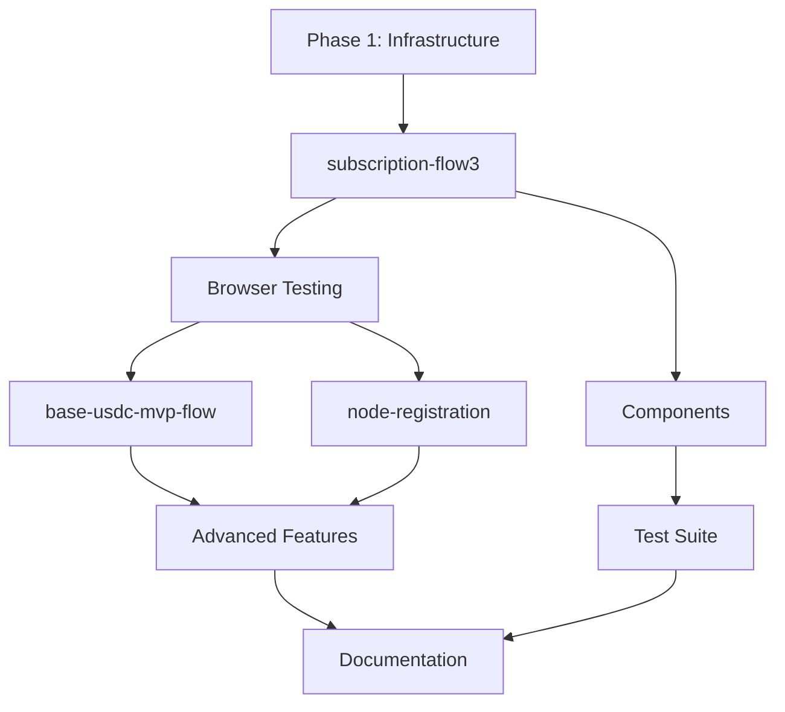

# Harness Application Migration to @fabstir/sdk-core

## Overview

This document outlines the phased migration of the harness application pages from direct contract interactions to using the browser-compatible @fabstir/sdk-core package. The migration will demonstrate real-world usage patterns of the refactored SDK and validate browser compatibility.

## Goals

1. **Validate Browser Compatibility**: Ensure sdk-core works seamlessly in Next.js/React
2. **Remove Node.js Dependencies**: Eliminate private key usage and Node-specific code from browser
3. **Demonstrate SDK Patterns**: Show best practices for using the new SDK architecture
4. **Maintain Functionality**: Preserve all existing features while improving code quality
5. **Create Migration Guide**: Document patterns for other applications to follow

---

## Phase 1: Infrastructure Setup

### Sub-phase 1.1: Build SDK Packages
**Goal**: Prepare sdk-core and sdk-node packages for use

#### Tasks:
- [ ] Build sdk-core package (`pnpm build` in packages/sdk-core)
- [ ] Build sdk-node package if needed (`pnpm build` in packages/sdk-node)
- [ ] Verify dist directories are created
- [ ] Check TypeScript declarations are generated
- [ ] Validate package exports are correct

### Sub-phase 1.2: Configure Harness Dependencies
**Goal**: Add SDK packages to harness application

#### Tasks:
- [ ] Add @fabstir/sdk-core to harness package.json
- [ ] Add @fabstir/sdk-node for development server if needed
- [ ] Update ethers to v6 if still on v5
- [ ] Run pnpm install in harness directory
- [ ] Verify no dependency conflicts

### Sub-phase 1.3: Environment Configuration
**Goal**: Set up environment variables for browser and server

#### Tasks:
- [ ] Create apps/harness/.env.local with NEXT_PUBLIC_ variables
- [ ] Add RPC URL configuration
- [ ] Add contract addresses (JobMarketplace, USDC, etc.)
- [ ] Add S5 configuration
- [ ] Configure bridge server URL if needed
- [ ] Update next.config.js to properly inject env vars

---

## Phase 2: Core Page Migrations

### Sub-phase 2.1: Migrate subscription-flow3.tsx
**Goal**: Convert subscription flow to use SDK managers

#### Tasks:
- [ ] Import FabstirSDKCore and required managers
- [ ] Replace hardcoded private key with proper authentication
- [ ] Convert direct USDC transfers to PaymentManager
- [ ] Integrate with Base Account SDK for smart wallets
- [ ] Update state management for SDK integration
- [ ] Handle SDK initialization and cleanup
- [ ] Test all four flow steps work correctly
- [ ] Verify no MetaMask popups with auto-spend

**Key Changes**:
```typescript
// Before: Direct contract with private key
const wallet = new ethers.Wallet(TEST_USER_1_PRIVATE_KEY, provider);
const usdcContract = new ethers.Contract(USDC, abi, wallet);

// After: SDK with wallet authentication
const sdk = new FabstirSDKCore(config);
await sdk.authenticate('metamask');
const paymentManager = sdk.getPaymentManager();
```

### Sub-phase 2.2: Migrate base-usdc-mvp-flow.test.tsx
**Goal**: Update MVP flow test page to use SDK

#### Tasks:
- [ ] Analyze current direct contract interactions
- [ ] Map contract calls to SDK manager methods
- [ ] Replace JobMarketplace direct calls with SessionManager
- [ ] Update USDC approval flow to use PaymentManager
- [ ] Convert session job creation to SDK patterns
- [ ] Maintain test assertions and flow logic
- [ ] Verify checkpoint system works through SDK
- [ ] Test proof submission if applicable

### Sub-phase 2.3: Migrate node-registration.tsx
**Goal**: Convert node registration to use SDK

#### Tasks:
- [ ] Import HostManager from sdk-core
- [ ] Replace direct NodeRegistry contract calls
- [ ] Use SDK for node registration flow
- [ ] Update host capability management
- [ ] Convert stake/unstake operations
- [ ] Test node discovery through SDK
- [ ] Verify host earnings tracking

---

## Phase 3: Component Updates

### Sub-phase 3.1: Update Shared Components
**Goal**: Refactor reusable components for SDK integration

#### Tasks:
- [ ] Update RunButton component to use SDK
- [ ] Refactor StatusDisplay for SDK events
- [ ] Create SDKProvider context for app-wide SDK instance
- [ ] Update wallet connection components
- [ ] Add SDK status indicators
- [ ] Create reusable transaction helpers

### Sub-phase 3.2: Create SDK Utilities
**Goal**: Build helper functions for common SDK operations

#### Tasks:
- [ ] Create SDK initialization helper
- [ ] Build transaction status monitor
- [ ] Add error handling utilities
- [ ] Create balance checking helpers
- [ ] Build approval management utilities
- [ ] Add network switching helpers

---

## Phase 4: Testing Infrastructure

### Sub-phase 4.1: Update Test Suite
**Goal**: Migrate tests to use SDK

#### Tasks:
- [ ] Update components.test.tsx to use SDK
- [ ] Create SDK mock for unit tests
- [ ] Update e2e tests for new flow
- [ ] Add SDK-specific test utilities
- [ ] Verify all tests pass
- [ ] Add new tests for SDK integration

### Sub-phase 4.2: Add Browser Testing
**Goal**: Validate browser compatibility

#### Tasks:
- [ ] Test in Chrome with MetaMask
- [ ] Test in Firefox
- [ ] Test in Safari with WalletConnect
- [ ] Test in Edge
- [ ] Verify mobile browser support
- [ ] Document any browser-specific issues

---

## Phase 5: Advanced Features

### Sub-phase 5.1: Implement Bridge Server Integration
**Goal**: Add P2P and proof features via bridge

#### Tasks:
- [ ] Set up bridge server for development
- [ ] Configure WebSocket connections
- [ ] Implement P2P discovery through bridge
- [ ] Add proof generation support
- [ ] Test inference flow end-to-end
- [ ] Handle bridge connection failures

### Sub-phase 5.2: Add Smart Wallet Features
**Goal**: Leverage SDK smart wallet capabilities

#### Tasks:
- [ ] Implement account abstraction features
- [ ] Add gasless transaction support
- [ ] Configure session keys
- [ ] Implement batch transactions
- [ ] Test spending limits
- [ ] Add recovery mechanisms

---

## Phase 6: Documentation and Cleanup

### Sub-phase 6.1: Remove Legacy Code
**Goal**: Clean up old implementations

#### Tasks:
- [ ] Remove direct contract interaction code
- [ ] Delete unused test files
- [ ] Remove hardcoded private keys
- [ ] Clean up old utility functions
- [ ] Remove deprecated pages (simple.js confirmed)
- [ ] Update or remove components.test.tsx

### Sub-phase 6.2: Create Documentation
**Goal**: Document the migration and new patterns

#### Tasks:
- [ ] Write migration guide for other apps
- [ ] Document SDK usage patterns
- [ ] Create troubleshooting guide
- [ ] Add inline code documentation
- [ ] Update README with new setup
- [ ] Create example snippets

---

## Implementation Order

### Critical Path (must be done in order):
1. Phase 1.1 → 1.2 → 1.3 (Infrastructure setup)
2. Phase 2.1 (First page migration for validation)
3. Phase 4.2 (Browser testing before continuing)

### Can Be Parallelized:
- Phase 2.2 and 2.3 (after 2.1 succeeds)
- Phase 3.1 and 3.2 (after Phase 2 starts)
- Phase 5.1 and 5.2 (independent features)

### Dependencies:


---

## Success Criteria

### Technical Requirements:
- [ ] All pages work without Node.js dependencies
- [ ] No private keys in browser code
- [ ] SDK properly abstracts contract interactions
- [ ] TypeScript types work correctly
- [ ] Bundle size remains reasonable (<1MB)
- [ ] No console errors in browser

### Functional Requirements:
- [ ] Subscription flow completes all 4 steps
- [ ] USDC payments work with auto-spend
- [ ] Node registration functions properly
- [ ] Smart wallet features work
- [ ] All existing features preserved

### Quality Requirements:
- [ ] Code is cleaner and more maintainable
- [ ] Clear separation of concerns
- [ ] Proper error handling throughout
- [ ] Consistent patterns across pages
- [ ] Well-documented migration path

---

## Risk Mitigation

### Potential Issues:
1. **Ethers v5 vs v6 incompatibility**
   - Solution: Carefully migrate or use compatibility layer
   
2. **MetaMask/Wallet connection issues**
   - Solution: Implement proper wallet detection and fallbacks
   
3. **Environment variable access in browser**
   - Solution: Use NEXT_PUBLIC_ prefix consistently
   
4. **Smart wallet integration complexity**
   - Solution: Keep Base Account SDK for smart wallet features
   
5. **Breaking changes in SDK API**
   - Solution: Version lock and thorough testing

---

## Timeline Estimate

- Phase 1: 1 day (Infrastructure setup)
- Phase 2: 3 days (Core migrations)
- Phase 3: 2 days (Component updates)
- Phase 4: 2 days (Testing)
- Phase 5: 2 days (Advanced features)
- Phase 6: 1 day (Documentation)

**Total: ~11 days**

---

## Current Status

```yaml
overall_progress: 10%
current_phase: Phase 1.1 Complete
next_action: Phase 1.2 - Configure Harness Dependencies
last_updated: 2025-01-11
```

### Phase Completion:
- [x] Sub-phase 1.1: Build SDK Packages ✅
  - [x] Built sdk-core package (JavaScript bundles + TypeScript declarations)
  - [x] Built sdk-node package (JavaScript bundles + TypeScript declarations)
  - [x] Verified dist directories created
  - [x] Checked TypeScript declarations generated
  - [x] Validated package exports are correct
  - Note: TypeScript compilation has some errors but JavaScript builds succeeded
- [ ] Phase 1: Infrastructure Setup
- [ ] Phase 2: Core Page Migrations
- [ ] Phase 3: Component Updates
- [ ] Phase 4: Testing Infrastructure
- [ ] Phase 5: Advanced Features
- [ ] Phase 6: Documentation and Cleanup

---

## Notes

- Start with subscription-flow3.tsx as it's the most complex
- Keep Base Account SDK for smart wallet features
- Focus on demonstrating SDK patterns for others to follow
- Document any SDK bugs or missing features discovered
- Consider creating a harness-specific SDK wrapper if patterns emerge