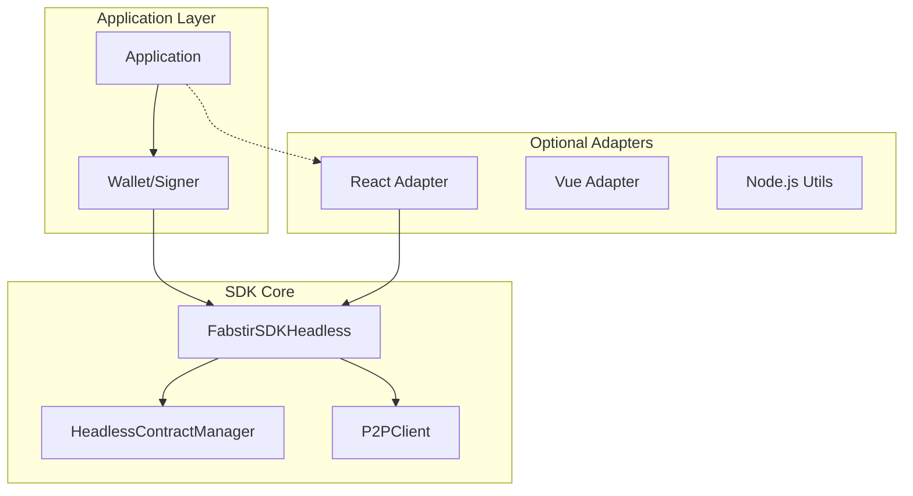
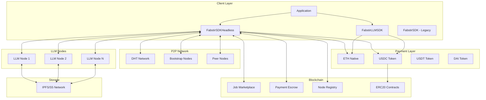
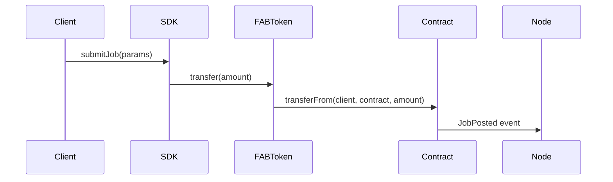
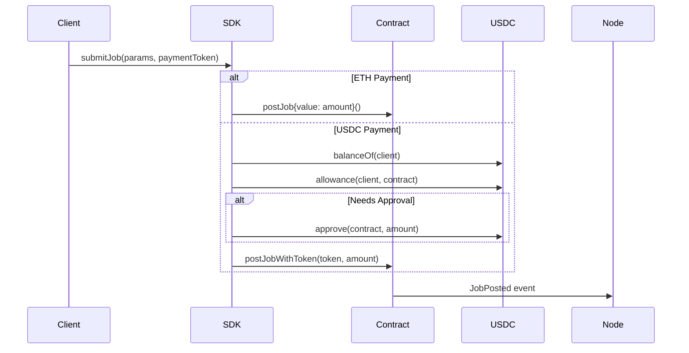
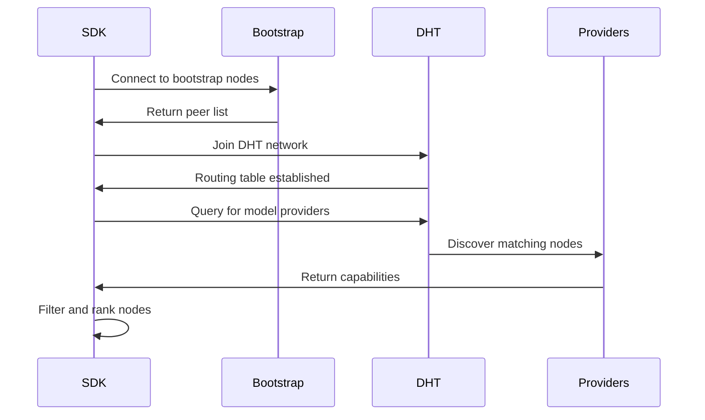
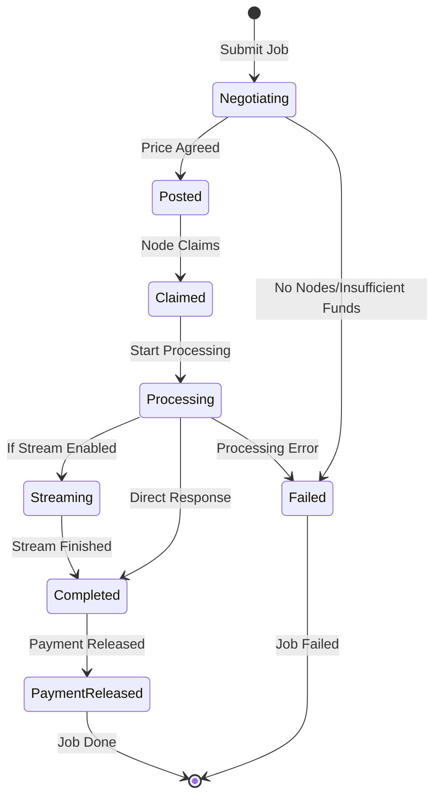
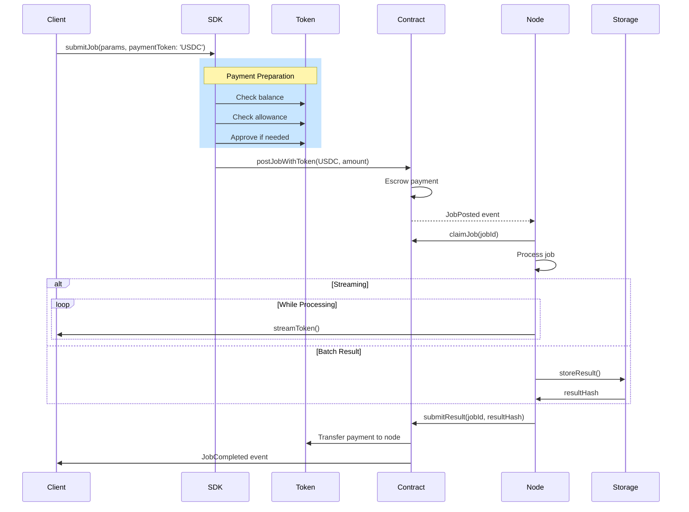
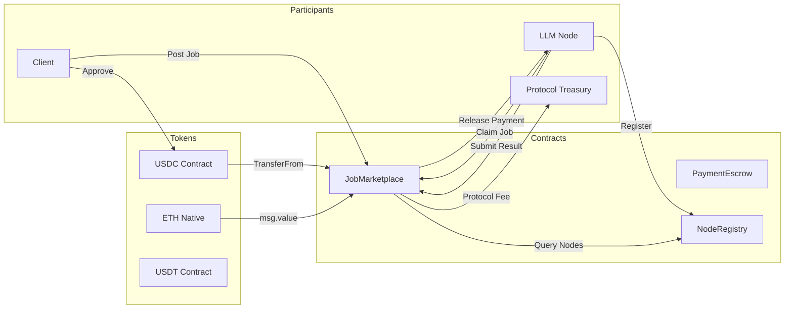
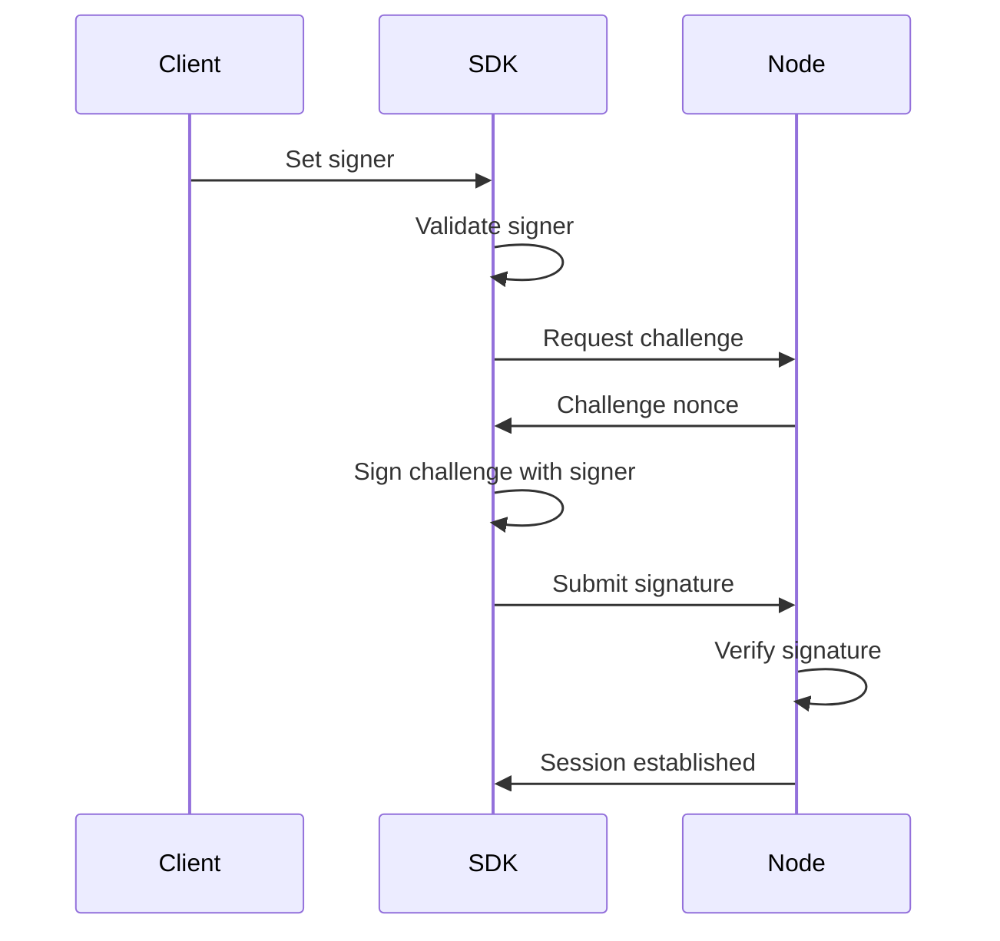

# Fabstir LLM SDK Architecture

This document provides a comprehensive overview of the Fabstir LLM SDK architecture, including the new headless design, payment system changes, and system components.

## Table of Contents

- [System Overview](#system-overview)
- [Headless Architecture](#headless-architecture)
- [Architecture Diagram](#architecture-diagram)
- [Core Components](#core-components)
- [Payment System](#payment-system)
- [P2P Discovery Process](#p2p-discovery-process)
- [Job Lifecycle](#job-lifecycle)
- [Contract Interaction Flow](#contract-interaction-flow)
- [Streaming Protocol](#streaming-protocol)
- [Security Architecture](#security-architecture)
- [Performance Considerations](#performance-considerations)

## System Overview

The Fabstir LLM SDK is built on a decentralized, headless architecture that enables direct peer-to-peer communication between clients and LLM nodes. The system eliminates central servers by leveraging:

- **libp2p** for P2P networking and discovery
- **Ethereum smart contracts** for trustless payments (USDC/ETH) and job coordination
- **IPFS/S5** for decentralized storage of results
- **WebRTC/WebSocket** for real-time streaming
- **Headless design** for environment-agnostic operation

### Key Design Principles

1. **Decentralization**: No single point of failure or control
2. **Headless Operation**: Works in any JavaScript environment (Node.js, browser, Deno)
3. **Flexible Payments**: Support for multiple payment tokens (ETH, USDC, USDT, DAI)
4. **Trustless**: Smart contracts ensure fair payment and delivery
5. **Scalable**: P2P architecture scales with network size
6. **Resilient**: Automatic failover and recovery mechanisms
7. **Privacy-Preserving**: Direct connections minimize data exposure

## Headless Architecture

The SDK now features a headless architecture that separates concerns and improves flexibility:



### Key Architectural Changes

1. **Dynamic Signer Management**: Signers are passed to the SDK, not created by it
2. **Environment Agnostic**: No browser-specific dependencies in core
3. **Adapter Pattern**: Optional framework-specific adapters for convenience
4. **Stateless Contracts**: Contract methods accept signers as parameters

## Architecture Diagram



## Core Components

### 1. FabstirSDKHeadless

The new headless SDK that accepts signers dynamically:

```typescript
class FabstirSDKHeadless extends EventEmitter {
  // No provider/signer stored at construction
  private provider?: ethers.providers.Provider;
  private signer?: ethers.Signer;
  
  // Dynamic signer management
  async setSigner(signer: ethers.Signer): Promise<void>
  clearSigner(): void
  hasSigner(): boolean
  
  // Core functionality
  private contracts: HeadlessContractManager;
  private p2pClient: P2PClient;
  private config: HeadlessConfig;
  
  // State management
  private jobs: Map<number, JobState>;
  private nodes: Map<string, NodeInfo>;
  private streams: Map<string, P2PResponseStream>;
}
```

**Key Features:**
- No browser dependencies
- Dynamic signer updates
- Works in Node.js, Deno, and browsers
- Event-driven architecture maintained

### 2. FabstirLLMSDK

Specialized SDK for smart contract interactions with USDC/ETH payment support:

```typescript
class FabstirLLMSDK extends EventEmitter {
  constructor(provider: ethers.providers.Provider)
  
  // Payment method routing
  async submitJob(params: JobSubmissionParams): Promise<string>
  private async submitJobWithUSDC(params: JobSubmissionParams): Promise<string>
  private async submitJobWithETH(params: JobSubmissionParams): Promise<string>
  
  // Automatic token approval handling
  private async ensureTokenApproval(token: string, amount: string): Promise<void>
}
```

**Payment Features:**
- Automatic payment token selection
- USDC balance checking
- Automatic approval handling
- ETH and ERC20 token support

### 3. HeadlessContractManager

Contract manager that accepts signers in method calls:

```typescript
class HeadlessContractManager {
  // No stored signer - passed in each method
  async postJob(
    jobDetails: JobDetails,
    requirements: JobRequirements,
    signer: ethers.Signer
  ): Promise<Transaction>
  
  async postJobWithToken(
    jobDetails: JobDetails,
    requirements: JobRequirements,
    paymentToken: string,
    paymentAmount: string,
    signer: ethers.Signer
  ): Promise<Transaction>
}
```

### 4. P2PClient

Handles all peer-to-peer networking (unchanged):

```typescript
class P2PClient {
  private libp2p: Libp2p;
  private discovery: PeerDiscovery;
  private protocols: Map<string, Protocol>;
  
  // Core P2P operations (work without signer)
  async findProviders(query: ProviderQuery): Promise<DiscoveredNode[]>
  async sendJobRequest(nodeId: string, request: JobRequest): Promise<JobResponse>
  async createStream(nodeId: string, options: StreamOptions): Promise<Stream>
}
```

## Payment System

### Payment Token Support

The SDK supports multiple payment tokens on Base Sepolia:

| Token | Symbol | Network | Base Sepolia Contract | Decimals |
|-------|--------|---------|----------------------|----------|
| Ether | ETH | Native | N/A | 18 |
| USD Coin | USDC | ERC20 | 0x036CbD53842c5426634e7929541eC2318f3dCF7e | 6 |
| FAB Token | FAB | ERC20 | 0xC78949004B4EB6dEf2D66e49Cd81231472612D62 | 18 |

### Payment Flow Comparison

#### Old Flow (FAB Tokens)


#### New Flow (USDC/ETH)


### Automatic Approval Management

The SDK automatically handles ERC20 token approvals:

```typescript
// Internal flow for USDC payments
async function submitJobWithUSDC(params) {
  // 1. Check balance
  const balance = await usdcContract.balanceOf(userAddress);
  if (balance < paymentAmount) throw new Error('Insufficient USDC');
  
  // 2. Check allowance
  const allowance = await usdcContract.allowance(userAddress, jobMarketplace);
  
  // 3. Approve if needed
  if (allowance < paymentAmount) {
    await usdcContract.approve(jobMarketplace, paymentAmount);
  }
  
  // 4. Submit job
  return await jobMarketplace.postJobWithToken(
    modelId, prompt, offerPrice, maxTokens, USDC_ADDRESS, paymentAmount
  );
}
```

## P2P Discovery Process

The SDK uses a multi-layered approach for discovering LLM nodes:

### Discovery Flow



### Node Selection Algorithm

```typescript
function selectOptimalNode(nodes: DiscoveredNode[], criteria: SelectionCriteria): DiscoveredNode {
  // 1. Filter by requirements
  const eligible = nodes.filter(node => 
    node.capabilities.models.includes(criteria.modelId) &&
    node.latency <= criteria.maxLatency &&
    parseInt(node.capabilities.pricePerToken) <= criteria.maxPrice
  );
  
  // 2. Score nodes
  const scored = eligible.map(node => ({
    node,
    score: calculateScore(node, criteria)
  }));
  
  // 3. Select best node
  return scored.sort((a, b) => b.score - a.score)[0].node;
}
```

## Job Lifecycle

### Job States



### Detailed Job Flow with Payments



## Contract Interaction Flow

### Smart Contract Architecture



## Security Architecture

### Authentication Flow



### Security Layers

1. **Transport Security**: TLS/Noise protocol for P2P connections
2. **Message Security**: End-to-end encryption for sensitive data
3. **Payment Security**: Smart contract escrow with atomic swaps
4. **Signer Security**: Application manages private keys, SDK never stores them

## Performance Considerations

### Connection Pooling

```typescript
class ConnectionPool {
  private connections: Map<string, Connection>;
  private maxConnections: number = 50;
  private idleTimeout: number = 300000; // 5 minutes
  
  async getConnection(nodeId: string): Promise<Connection> {
    // Reuse existing connection
    if (this.connections.has(nodeId)) {
      return this.connections.get(nodeId);
    }
    
    // Create new connection with limits
    if (this.connections.size >= this.maxConnections) {
      await this.evictIdleConnections();
    }
    
    const conn = await this.createConnection(nodeId);
    this.connections.set(nodeId, conn);
    return conn;
  }
}
```

### Caching Strategy

- **Node Discovery**: 5-minute TTL for discovered nodes
- **Token Balances**: Cached per block
- **Allowances**: Cached until changed
- **Job Results**: Permanent cache in IPFS

## Design Decisions

### Why Headless Architecture?

- **Flexibility**: Works in any JavaScript environment
- **Separation of Concerns**: Applications manage wallets, SDK handles operations
- **Testability**: Easier to test without browser dependencies
- **Maintainability**: Cleaner codebase with single responsibility

### Why USDC/ETH over FAB Tokens?

- **Liquidity**: Major tokens have better liquidity
- **User Experience**: Users already have ETH/USDC
- **Reduced Friction**: No need to acquire custom tokens
- **Market Standard**: Aligns with DeFi ecosystem

### Why Dynamic Signer Management?

- **Security**: SDK never stores private keys
- **Flexibility**: Easy wallet switching
- **Multi-Account**: Support for multiple signers
- **Framework Agnostic**: Works with any wallet library

### Future Enhancements

1. **Multi-chain Support**: Deploy to multiple L2s
2. **Advanced Payment Options**: Subscription models, batch payments
3. **Zero-Knowledge Proofs**: Privacy-preserving job submissions
4. **Decentralized Governance**: DAO for protocol upgrades
5. **Cross-chain Bridges**: Payment token bridges between chains