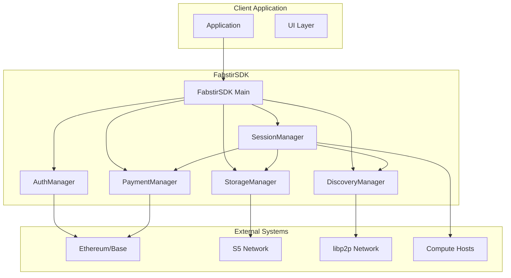
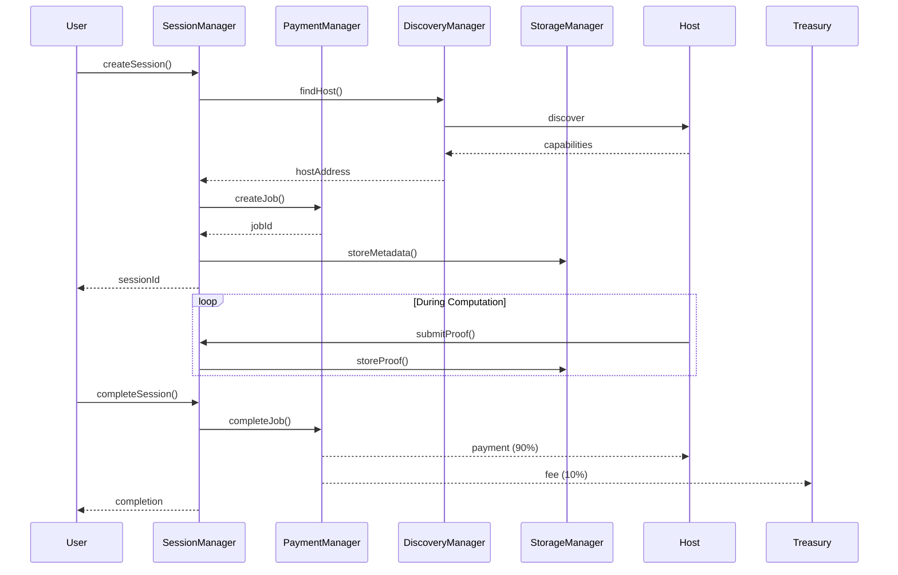

# Fabstir LLM SDK Architecture

This document provides a comprehensive overview of the Fabstir LLM SDK's manager-based architecture, system components, and design principles.

## Table of Contents

- [System Overview](#system-overview)
- [Manager-Based Architecture](#manager-based-architecture)
- [Architecture Diagram](#architecture-diagram)
- [Core Components](#core-components)
- [Manager Components](#manager-components)
- [Payment System](#payment-system)
- [P2P Discovery Process](#p2p-discovery-process)
- [Session Lifecycle](#session-lifecycle)
- [Contract Interaction Flow](#contract-interaction-flow)
- [Storage Architecture](#storage-architecture)
- [Security Architecture](#security-architecture)
- [Performance Considerations](#performance-considerations)

## System Overview

The Fabstir LLM SDK uses a manager-based architecture that provides clean separation of concerns while enabling decentralized LLM access. The system leverages:

- **Manager Pattern** for modular functionality (Auth, Payment, Storage, Discovery, Session)
- **libp2p** for P2P networking and node discovery
- **Ethereum smart contracts** for trustless payments (ETH/USDC) and job coordination
- **S5 Network** for decentralized storage of conversations and session data
- **WebSocket** for real-time communication
- **Session-based jobs** for efficient multi-turn conversations

### Key Design Principles

1. **Modularity**: Each manager handles a specific domain
2. **Decentralization**: No central servers or control points
3. **Authentication-First**: All operations require wallet authentication
4. **Flexible Payments**: Support for ETH and USDC payments
5. **Trustless**: Smart contracts ensure fair payment distribution
6. **Scalable**: P2P architecture scales with network growth
7. **Privacy-Preserving**: Direct peer connections and encrypted storage

## Manager-Based Architecture

The SDK uses five specialized managers, each responsible for a specific aspect of functionality:

```
┌─────────────────────────────────────────┐
│           FabstirSDK (Main)             │
│                                         │
│  ┌─────────────────────────────────┐   │
│  │        AuthManager              │   │
│  │  - Wallet authentication        │   │
│  │  - S5 seed generation           │   │
│  └─────────────────────────────────┘   │
│                                         │
│  ┌─────────────────────────────────┐   │
│  │        PaymentManager           │   │
│  │  - ETH/USDC payments           │   │
│  │  - Job creation                │   │
│  │  - Token approvals             │   │
│  └─────────────────────────────────┘   │
│                                         │
│  ┌─────────────────────────────────┐   │
│  │        StorageManager           │   │
│  │  - S5 network integration      │   │
│  │  - Data persistence            │   │
│  │  - Conversation storage        │   │
│  └─────────────────────────────────┘   │
│                                         │
│  ┌─────────────────────────────────┐   │
│  │        DiscoveryManager         │   │
│  │  - P2P node creation           │   │
│  │  - Host discovery              │   │
│  │  - Peer messaging              │   │
│  └─────────────────────────────────┘   │
│                                         │
│  ┌─────────────────────────────────┐   │
│  │        SessionManager           │   │
│  │  - Session orchestration       │   │
│  │  - Proof submission            │   │
│  │  - Payment distribution        │   │
│  └─────────────────────────────────┘   │
└─────────────────────────────────────────┘
```

## Architecture Diagram



## Core Components

### FabstirSDK

The main SDK class that:
- Manages SDK configuration
- Handles authentication flow
- Provides access to all managers
- Maintains singleton manager instances

```typescript
class FabstirSDK {
  constructor(config: SDKConfig)
  authenticate(privateKey: string): Promise<AuthResult>
  getAuthManager(): AuthManager
  getPaymentManager(): PaymentManager
  getStorageManager(): Promise<StorageManager>
  getDiscoveryManager(): DiscoveryManager
  getSessionManager(): Promise<SessionManager>
}
```

### SDKConfig

Configuration for the SDK:

```typescript
interface SDKConfig {
  rpcUrl?: string;              // Ethereum RPC endpoint
  s5PortalUrl?: string;         // S5 storage portal
  contractAddresses?: {
    jobMarketplace?: string;
    nodeRegistry?: string;
    usdcToken?: string;
  };
}
```

## Manager Components

### 1. AuthManager

Handles all authentication-related operations:

- **Wallet Integration**: Supports private key authentication
- **Signer Management**: Provides ethers.js signer for transactions
- **S5 Seed Generation**: Derives deterministic seed from wallet signature
- **Network Detection**: Identifies and validates chain ID

Key Methods:
- `authenticate()`: Authenticate with provider
- `getSigner()`: Get ethers signer
- `getS5Seed()`: Get S5 storage seed
- `getUserAddress()`: Get wallet address
- `isAuthenticated()`: Check auth status

### 2. PaymentManager

Manages all payment operations:

- **ETH Payments**: Direct ETH transfers for jobs
- **USDC Payments**: ERC20 token payments with approval
- **Job Creation**: Creates session jobs on smart contracts
- **Gas Estimation**: Calculates transaction costs
- **Payment Tracking**: Monitors payment status

Key Methods:
- `createETHSessionJob()`: Create ETH-funded job
- `approveUSDC()`: Approve USDC spending
- `createUSDCSessionJob()`: Create USDC-funded job
- `completeSessionJob()`: Complete job and release payment

### 3. StorageManager

Interfaces with S5 decentralized storage:

- **S5 Client**: Manages S5 network connection
- **Data Persistence**: Stores conversation data
- **Content Addressing**: Uses CIDs for data retrieval
- **Metadata Support**: Attaches metadata to stored data
- **User Data Management**: Lists and manages user's data

Key Methods:
- `initialize()`: Setup S5 client with auth
- `storeData()`: Store data with optional metadata
- `retrieveData()`: Retrieve data by key
- `listUserData()`: List all user's stored data

### 4. DiscoveryManager

Handles P2P networking and discovery:

- **libp2p Integration**: Full libp2p v2.x support
- **Node Creation**: Creates and manages P2P nodes
- **Peer Discovery**: DHT-based peer discovery
- **Direct Messaging**: Peer-to-peer messaging
- **Host Selection**: Finds suitable compute hosts

Key Methods:
- `createNode()`: Start P2P node
- `connectToPeer()`: Connect to specific peer
- `getConnectedPeers()`: List connected peers
- `sendMessage()`: Send message to peer
- `findHost()`: Find host matching criteria
- `stop()`: Shutdown P2P node

### 5. SessionManager

Orchestrates complete session workflows:

- **Session Creation**: Coordinates job creation with discovery
- **Proof Management**: Handles proof submission
- **Payment Distribution**: Manages 90/10 payment split
- **Session Storage**: Persists session data
- **Status Tracking**: Monitors session lifecycle

Key Methods:
- `createSession()`: Create new compute session
- `submitProof()`: Submit computation proof
- `completeSession()`: Complete and distribute payments
- `storeSessionData()`: Store session-specific data
- `getSessionData()`: Retrieve session data
- `getSessionStatus()`: Check session status

## Payment System

### Payment Flow

1. **Job Creation**: User creates job with payment (ETH or USDC)
2. **Escrow**: Payment held in smart contract
3. **Execution**: Host performs computation
4. **Proof Submission**: Host submits proof of work
5. **Payment Release**: Contract distributes payment (90% host, 10% treasury)

### ETH Payment

```typescript
// Direct ETH transfer with job creation
await paymentManager.createETHSessionJob(
  hostAddress,
  '0.005',  // ETH amount
  5000,     // price per token
  3600,     // duration
  300       // proof interval
);
```

### USDC Payment

```typescript
// Requires approval first
await paymentManager.approveUSDC(usdcAddress, '100');
await paymentManager.createUSDCSessionJob(
  hostAddress,
  usdcAddress,
  '100',    // USDC amount
  5000,     // price per token
  3600,     // duration
  300       // proof interval
);
```

## P2P Discovery Process

1. **Node Initialization**
   ```typescript
   await discoveryManager.createNode({
     listen: ['/ip4/0.0.0.0/tcp/4001'],
     bootstrap: [...]
   });
   ```

2. **DHT Population**
   - Node connects to bootstrap peers
   - DHT routing tables populate
   - Peer capabilities advertised

3. **Host Discovery**
   ```typescript
   const host = await discoveryManager.findHost({
     minReputation: 100,
     requiredModels: ['llama-3.2-1b']
   });
   ```

4. **Direct Communication**
   - Establish direct connection to selected host
   - Exchange job details and negotiate terms
   - Begin computation

## Session Lifecycle



## Contract Interaction Flow

### Smart Contract Architecture

```
┌──────────────────────────┐
│   JobMarketplaceFABWithS5│
│                          │
│  - createSessionJobETH() │
│  - createSessionJobToken()│
│  - completeSessionJob()  │
│  - submitProof()         │
└──────────────────────────┘
            │
            ├──────────────┐
            │              │
    ┌───────▼────┐  ┌──────▼──────┐
    │NodeRegistry│  │ProofSystem  │
    │            │  │             │
    │ - register │  │ - verify    │
    │ - lookup   │  │ - store     │
    └────────────┘  └─────────────┘
```

### Contract Addresses (Base Sepolia - Jan 2025)

- JobMarketplace: `0xD937c594682Fe74E6e3d06239719805C04BE804A`
- NodeRegistry: `0x87516C13Ea2f99de598665e14cab64E191A0f8c4`
- ProofSystem: `0x2ACcc60893872A499700908889B38C5420CBcFD1`
- USDC Token: `0x036CbD53842c5426634e7929541eC2318f3dCF7e`

## Storage Architecture

### S5 Network Integration

```
┌─────────────────┐
│  StorageManager │
└────────┬────────┘
         │
    ┌────▼────┐
    │S5 Client│
    └────┬────┘
         │
┌────────▼────────┐
│   S5 Network    │
│                 │
│ - Decentralized │
│ - Content-based │
│ - Encrypted     │
└─────────────────┘
```

### Data Types Stored

1. **Session Metadata**: Job details, timestamps, participants
2. **Conversation Data**: Messages, prompts, responses
3. **Proof Data**: Computation proofs, checkpoints
4. **User Preferences**: Settings, model preferences

## Security Architecture

### Authentication Security

- Private keys never leave client
- S5 seed derived from wallet signature
- All managers require authentication

### Payment Security

- Smart contract escrow
- Atomic payment distribution
- No trust required between parties

### Data Security

- End-to-end encryption in S5
- Content-addressed storage
- User-controlled access

### Network Security

- libp2p encryption (Noise protocol)
- Peer identity verification
- DHT security features

## Performance Considerations

### Optimization Strategies

1. **Connection Pooling**: Reuse P2P connections
2. **Caching**: Cache discovery results
3. **Batch Operations**: Batch storage operations
4. **Lazy Loading**: Initialize managers on-demand
5. **Stream Processing**: Use streaming for large responses

### Benchmarks

| Operation | Expected Time | Notes |
|-----------|--------------|-------|
| Authentication | < 1s | Wallet signature |
| Session Creation | 3-5s | Including discovery |
| S5 Store (1KB) | 1-2s | Depends on network |
| P2P Discovery | 2-5s | First discovery |
| Job Creation | 3-5s | Blockchain tx |
| USDC Approval | 2-4s | One-time per token |

### Scalability Factors

- **P2P Network Size**: More peers improve discovery
- **S5 Network Load**: Distributed storage scales well
- **Blockchain Congestion**: Affects transaction times
- **Host Availability**: More hosts reduce wait times

## Future Enhancements

### Planned Features

1. **Multi-Model Sessions**: Single session, multiple models
2. **Batch Job Processing**: Multiple prompts in one transaction
3. **Advanced Routing**: Intelligent host selection
4. **Cross-Chain Support**: Expand beyond Base
5. **Privacy Features**: Zero-knowledge proofs
6. **Model Marketplace**: Direct model trading

### Architecture Evolution

- Enhanced manager modularity
- Plugin system for custom managers
- WebAssembly support for compute
- IPFS integration alongside S5
- Layer 2 scaling solutions

## See Also

- [SDK API Reference](SDK_API.md)
- [Manager Documentation](SDK_QUICK_REFERENCE.md)
- [P2P Configuration](P2P_CONFIGURATION.md)
- [Setup Guide](SETUP_GUIDE.md)
- [Integration Testing](INTEGRATED_TESTING.md)

---

*Last updated: January 2025 - Manager-Based Architecture v2.0*