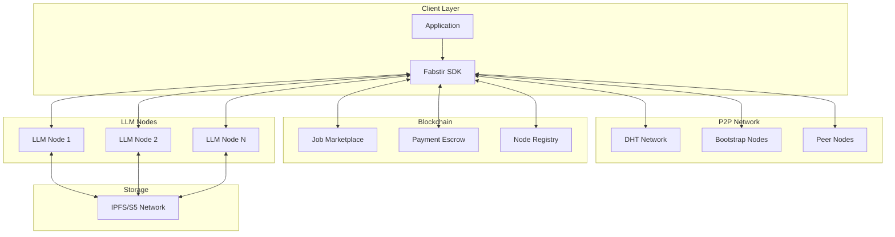
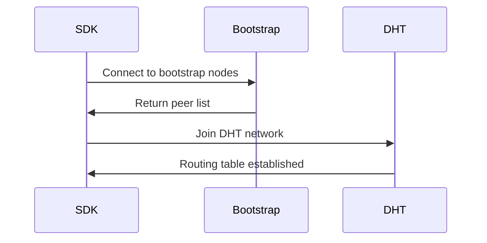
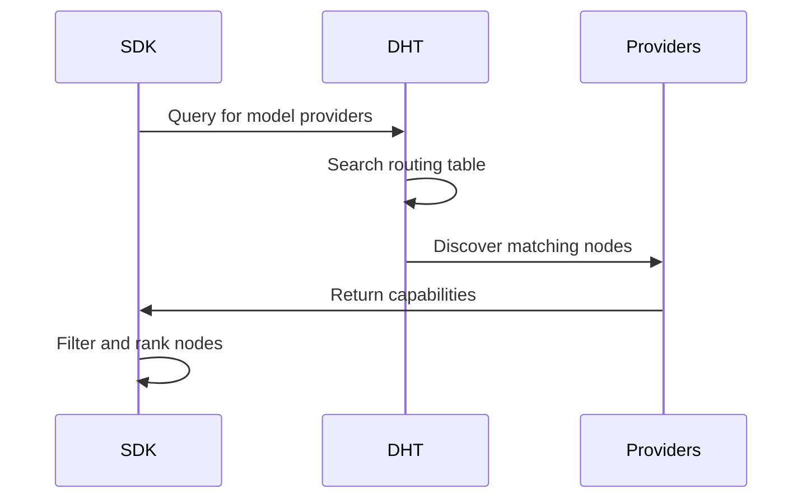
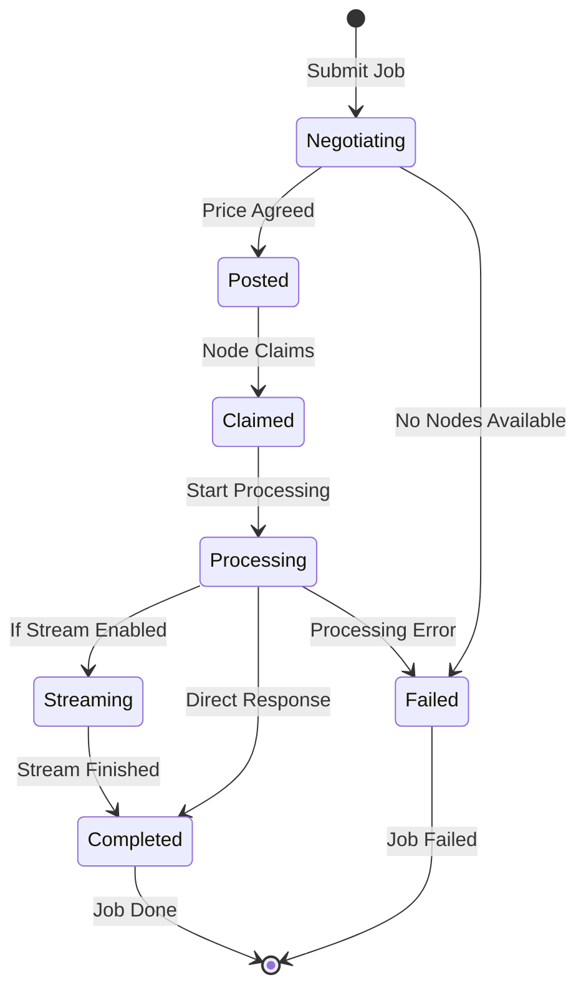
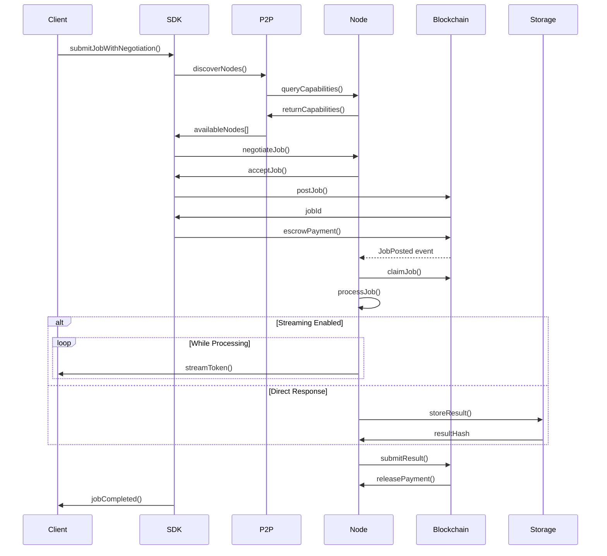
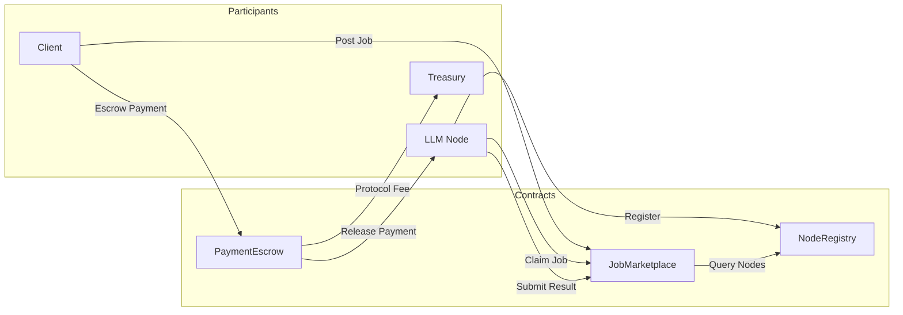
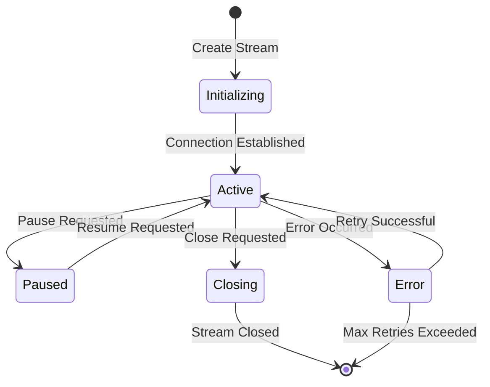
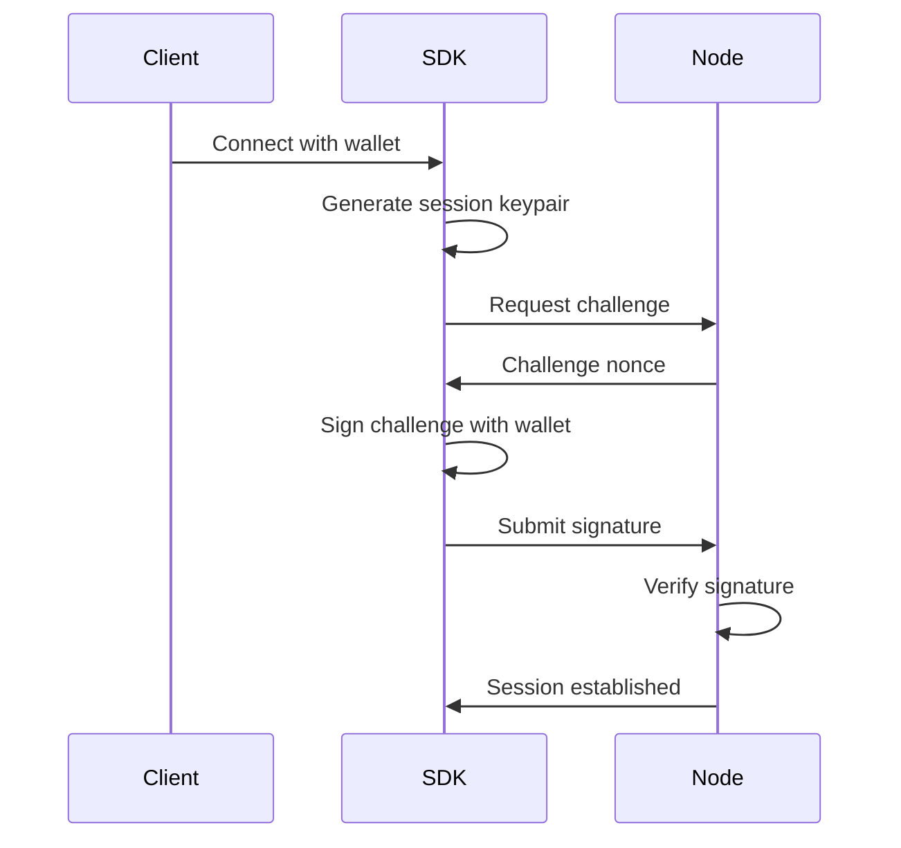

# Fabstir LLM SDK Architecture

This document provides a comprehensive overview of the Fabstir LLM SDK architecture, including system components, data flows, and design decisions.

## Table of Contents

- [System Overview](#system-overview)
- [Architecture Diagram](#architecture-diagram)
- [Core Components](#core-components)
- [P2P Discovery Process](#p2p-discovery-process)
- [Job Lifecycle](#job-lifecycle)
- [Contract Interaction Flow](#contract-interaction-flow)
- [Streaming Protocol](#streaming-protocol)
- [Security Architecture](#security-architecture)
- [Performance Considerations](#performance-considerations)

## System Overview

The Fabstir LLM SDK is built on a decentralized architecture that enables direct peer-to-peer communication between clients and LLM nodes. The system eliminates central servers by leveraging:

- **libp2p** for P2P networking and discovery
- **Ethereum smart contracts** for trustless payments and job coordination
- **IPFS/S5** for decentralized storage of results
- **WebRTC/WebSocket** for real-time streaming

### Key Design Principles

1. **Decentralization**: No single point of failure or control
2. **Trustless**: Smart contracts ensure fair payment and delivery
3. **Scalable**: P2P architecture scales with network size
4. **Resilient**: Automatic failover and recovery mechanisms
5. **Privacy-Preserving**: Direct connections minimize data exposure

## Architecture Diagram



## Core Components

### 1. FabstirSDK

The main entry point that orchestrates all operations:

```typescript
class FabstirSDK extends EventEmitter {
  // Core properties
  private provider: ethers.providers.Provider;
  private contracts: ContractManager;
  private p2pClient: P2PClient;
  private config: SDKConfig;
  
  // State management
  private jobs: Map<number, JobState>;
  private nodes: Map<string, NodeInfo>;
  private streams: Map<string, P2PResponseStream>;
}
```

**Responsibilities:**
- Connection management
- Job submission and monitoring
- Node discovery and selection
- Event emission and handling
- Mode switching (mock/production)

### 2. P2PClient

Handles all peer-to-peer networking:

```typescript
class P2PClient {
  private libp2p: Libp2p;
  private discovery: PeerDiscovery;
  private protocols: Map<string, Protocol>;
  
  // Core P2P operations
  async findProviders(query: ProviderQuery): Promise<DiscoveredNode[]>
  async sendJobRequest(nodeId: string, request: JobRequest): Promise<JobResponse>
  async createStream(nodeId: string, options: StreamOptions): Promise<Stream>
}
```

**Key Features:**
- DHT-based peer discovery
- Direct node communication
- Stream multiplexing
- Connection management
- Protocol negotiation

### 3. ContractManager

Interfaces with blockchain smart contracts:

```typescript
class ContractManager {
  private jobMarketplace: JobMarketplace;
  private paymentEscrow: PaymentEscrow;
  private nodeRegistry: NodeRegistry;
  
  // Contract interactions
  async postJob(params: JobParams): Promise<number>
  async escrowPayment(jobId: number, amount: BigNumber): Promise<void>
  async claimJob(jobId: number): Promise<void>
}
```

**Contract Interactions:**
- Job posting and claiming
- Payment escrow and release
- Node registration and updates
- Dispute resolution

### 4. StreamManager

Manages real-time response streaming:

```typescript
class StreamManager {
  private streams: Map<string, StreamState>;
  private buffers: Map<string, Buffer>;
  
  // Stream operations
  createStream(jobId: string, nodeId: string): P2PResponseStream
  handleIncomingData(streamId: string, data: Uint8Array): void
  resumeStream(streamId: string, checkpoint: number): void
}
```

## P2P Discovery Process

The SDK uses a multi-layered approach for discovering LLM nodes:

### 1. Bootstrap Connection



### 2. Provider Discovery



### 3. Node Selection Algorithm

```typescript
function selectOptimalNode(nodes: DiscoveredNode[], criteria: SelectionCriteria): DiscoveredNode {
  // 1. Filter by requirements
  const eligible = nodes.filter(node => 
    node.capabilities.models.includes(criteria.modelId) &&
    node.latency <= criteria.maxLatency &&
    parseInt(node.capabilities.pricePerToken) <= criteria.maxPrice
  );
  
  // 2. Score nodes
  const scored = eligible.map(node => ({
    node,
    score: calculateScore(node, criteria)
  }));
  
  // 3. Select best node
  return scored.sort((a, b) => b.score - a.score)[0].node;
}

function calculateScore(node: DiscoveredNode, criteria: SelectionCriteria): number {
  const latencyScore = 1 - (node.latency / criteria.maxLatency);
  const reputationScore = node.reputation / 100;
  const priceScore = 1 - (parseInt(node.capabilities.pricePerToken) / criteria.maxPrice);
  
  // Weighted scoring
  return (latencyScore * 0.3) + (reputationScore * 0.5) + (priceScore * 0.2);
}
```

## Job Lifecycle

A job goes through multiple stages from submission to completion:

### 1. Job Submission Flow



### 2. Detailed Job Flow



## Contract Interaction Flow

### Smart Contract Architecture



### Payment Flow

1. **Escrow**: Client deposits payment into escrow contract
2. **Lock**: Funds are locked when node claims the job
3. **Release**: Payment released on successful completion
4. **Refund**: Client can reclaim funds if job fails
5. **Dispute**: Either party can initiate dispute resolution

## Streaming Protocol

The SDK implements a custom streaming protocol for real-time token delivery:

### Protocol Specification

```typescript
// Stream initialization
interface StreamInit {
  version: "1.0.0";
  jobId: string;
  nodeId: string;
  checkpoint?: number;
  compression?: "none" | "gzip";
}

// Token message
interface TokenMessage {
  type: "token";
  index: number;
  content: string;
  timestamp: number;
  metadata?: {
    modelId: string;
    temperature: number;
    cumulativeLogProb?: number;
  };
}

// Control messages
interface ControlMessage {
  type: "pause" | "resume" | "checkpoint" | "error" | "end";
  data: any;
}
```

### Stream State Machine



### Buffering and Flow Control

```typescript
class StreamBuffer {
  private buffer: CircularBuffer<TokenMessage>;
  private highWaterMark: number = 1000;
  private lowWaterMark: number = 100;
  
  async handleIncoming(token: TokenMessage) {
    if (this.buffer.size() >= this.highWaterMark) {
      await this.pause();
    }
    
    this.buffer.push(token);
    this.emit('token', token);
    
    if (this.isPaused && this.buffer.size() <= this.lowWaterMark) {
      await this.resume();
    }
  }
}
```

## Security Architecture

### 1. Authentication Flow



### 2. Encryption Layers

- **Transport**: TLS/Noise protocol for P2P connections
- **Message**: End-to-end encryption for sensitive data
- **Storage**: Client-side encryption before IPFS storage

### 3. Access Control

```typescript
// Role-based permissions
enum Role {
  CLIENT = "client",
  NODE = "node", 
  ARBITRATOR = "arbitrator"
}

// Permission checks
function canSubmitJob(address: string): boolean {
  return hasRole(address, Role.CLIENT) && 
         hasMinimumBalance(address) &&
         !isBlacklisted(address);
}
```

## Performance Considerations

### 1. Connection Pooling

```typescript
class ConnectionPool {
  private connections: Map<string, Connection>;
  private maxConnections: number = 50;
  private idleTimeout: number = 300000; // 5 minutes
  
  async getConnection(nodeId: string): Promise<Connection> {
    // Reuse existing connection
    if (this.connections.has(nodeId)) {
      return this.connections.get(nodeId);
    }
    
    // Create new connection
    if (this.connections.size >= this.maxConnections) {
      await this.evictIdleConnections();
    }
    
    const conn = await this.createConnection(nodeId);
    this.connections.set(nodeId, conn);
    return conn;
  }
}
```

### 2. Caching Strategy

```typescript
class NodeCache {
  private cache: LRUCache<string, CachedNode>;
  private ttl: number = 300000; // 5 minutes
  
  async getNodes(modelId: string): Promise<DiscoveredNode[]> {
    const cacheKey = `nodes:${modelId}`;
    
    // Check cache
    if (this.cache.has(cacheKey)) {
      const cached = this.cache.get(cacheKey);
      if (Date.now() - cached.timestamp < this.ttl) {
        return cached.nodes;
      }
    }
    
    // Fetch fresh data
    const nodes = await this.p2p.discoverNodes({ modelId });
    this.cache.set(cacheKey, { nodes, timestamp: Date.now() });
    return nodes;
  }
}
```

### 3. Optimistic Updates

```typescript
// Update UI immediately, verify later
async submitJobOptimistic(params: JobParams) {
  // 1. Generate temporary ID
  const tempId = generateTempId();
  
  // 2. Update UI immediately
  this.emit('job:submitted', { jobId: tempId, status: 'pending' });
  
  // 3. Submit actual job
  try {
    const realId = await this.submitJob(params);
    this.emit('job:confirmed', { tempId, realId });
  } catch (error) {
    this.emit('job:failed', { tempId, error });
  }
}
```

### 4. Parallel Operations

```typescript
// Execute operations in parallel when possible
async submitMultipleJobs(jobs: JobParams[]) {
  // Discover nodes for all models in parallel
  const modelIds = [...new Set(jobs.map(j => j.modelId))];
  const nodesByModel = await Promise.all(
    modelIds.map(async modelId => ({
      modelId,
      nodes: await this.discoverNodes({ modelId })
    }))
  );
  
  // Submit jobs in parallel
  const results = await Promise.allSettled(
    jobs.map(job => this.submitJobWithNegotiation(job))
  );
  
  return results;
}
```

## Design Decisions

### Why libp2p?

- **Proven**: Battle-tested in IPFS and other projects
- **Modular**: Pick only needed components
- **Cross-platform**: Works in browser and Node.js
- **NAT traversal**: Built-in hole punching
- **Protocol agnostic**: Supports multiple transports

### Why Ethereum L2 (Base)?

- **Low fees**: Fraction of mainnet costs
- **Fast finality**: Quick transaction confirmation
- **EVM compatible**: Existing tooling works
- **Growing ecosystem**: Active development
- **Security**: Inherits Ethereum security

### Why EventEmitter Pattern?

- **Familiar**: Standard Node.js pattern
- **Flexible**: Easy to extend
- **Decoupled**: Loose coupling between components
- **Async-friendly**: Natural fit for async operations
- **Debuggable**: Easy to trace event flow

### Future Enhancements

1. **Multi-chain Support**: Deploy to multiple L2s
2. **Advanced Routing**: ML-based node selection
3. **Compression**: Reduce bandwidth usage
4. **Caching Layer**: Edge caching for popular queries
5. **Federation**: Cross-network job routing