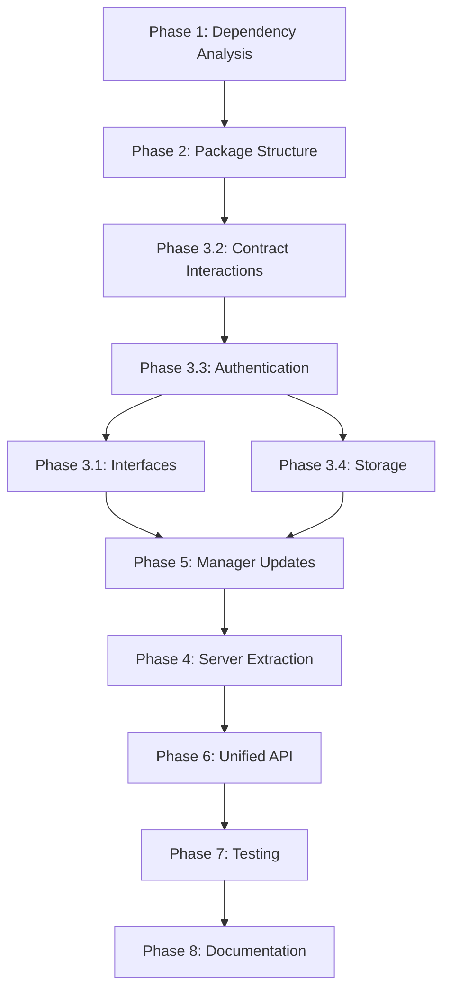

# SDK Browser Compatibility Refactor - Context Primer

## CRITICAL: Start Here When Continuing Work

This document contains all essential context for continuing the FabstirSDK browser compatibility refactor. Read this first when starting a new session.

---

## 1. THE PROBLEM (Why This Refactor Exists)

### Current Situation
- **FabstirSDK cannot run in browsers** due to Node.js dependencies
- UI developers **cannot** use the SDK directly in React/Vue/Angular components
- Current error: `Module build failed: UnhandledSchemeError: Reading from "node:assert" is not handled`
- This blocks the entire UI development workflow

### Impact
- UI developers must use workarounds (API routes, direct contract calls)
- Cannot leverage SDK's built-in functionality
- Duplicated logic between frontend and backend
- Poor developer experience

### Solution
- Split SDK into two packages:
  - `@fabstir/sdk-core`: Browser-compatible
  - `@fabstir/sdk-node`: Server-only features

---

## 2. PROJECT STRUCTURE & KEY FILES

### Current Structure
```
/workspace/
├── src/                          # Current SDK source
│   ├── FabstirSDK.ts            # Main SDK class (HAS NODE DEPS)
│   ├── managers/                # Manager implementations
│   │   ├── AuthManager.ts       # Authentication (uses node:crypto)
│   │   ├── PaymentManager.ts    # Payments (mostly browser-safe)
│   │   ├── StorageManager.ts    # S5.js storage (browser-compatible)
│   │   ├── SessionManager.ts    # Sessions (mixed deps)
│   │   ├── HostManager.ts       # Host operations (mostly browser-safe)
│   │   ├── DiscoveryManager.ts  # P2P discovery (NODE ONLY - libp2p)
│   │   └── InferenceManager.ts  # Inference (mixed deps)
│   ├── p2p/                     # P2P networking (NODE ONLY)
│   │   ├── client.ts            # libp2p client
│   │   └── WebSocketClient.ts   # WS client (needs refactor)
│   ├── contracts/               # Contract interactions
│   │   └── abis/               # Contract ABIs (browser-safe)
│   └── storage/                # S5.js integration
│       └── S5Client.ts         # S5 client (browser-compatible)
├── packages/                    # NEW: Refactored packages
│   ├── sdk-core/               # Browser-compatible SDK
│   └── sdk-node/               # Server-only extensions
├── tests/                      # Test suites
├── apps/harness/              # Demo/test pages
└── docs/
    ├── IMPLEMENTATION5.md     # The refactor plan
    └── SDK_REFACTOR_CONTEXT_PRIMER.md  # This file
```

### Target Structure After Refactor
```
packages/
├── sdk-core/                   # Pure browser package
│   ├── src/
│   │   ├── FabstirSDKCore.ts  # Browser-safe SDK
│   │   ├── managers/          # Browser-safe managers
│   │   ├── contracts/         # Contract interactions
│   │   └── types/            # Shared types
│   └── package.json           # Browser-compatible deps only
└── sdk-node/                  # Server extensions
    ├── src/
    │   ├── FabstirSDKNode.ts  # Extends Core
    │   ├── p2p/               # P2P networking
    │   └── proof/             # EZKL proofs
    └── package.json           # Node.js deps
```

---

## 3. DEPENDENCIES ANALYSIS

### Node.js Dependencies to Remove/Replace

| Current Import | Location | Browser Replacement |
|----------------|----------|-------------------|
| `node:crypto` | AuthManager | Web Crypto API |
| `node:assert` | Multiple files | Remove or use console.assert |
| `node:buffer` | Various | Browser Buffer polyfill |
| `libp2p` | DiscoveryManager | Move to sdk-node |
| `ws` package | WebSocketClient | Native WebSocket |
| `node:stream` | P2P code | Move to sdk-node |
| `fs` operations | None found | S5.js handles storage |

### Browser-Compatible Dependencies
- ✅ `ethers` (v6) - Works in browser
- ✅ `@s5-dev/s5js` - Already browser-compatible
- ✅ Contract ABIs - Pure JSON
- ✅ `fetch` API - Native in browser

---

## 4. REFACTOR IMPLEMENTATION PLAN

### Phase Order and Dependencies



### Critical Path (MUST be done in order)
1. **Phase 1**: Complete dependency analysis (2 days)
2. **Phase 2**: Setup package structure (2 days)
3. **Phase 3.2**: Contract interactions (1 day)
4. **Phase 3.3**: Authentication refactor (1 day)

### Can Be Parallelized
- Phase 5 sub-phases (different managers)
- Documentation (alongside coding)
- Testing (alongside implementation)

---

## 5. IMPLEMENTATION PROGRESS TRACKER

### Current Status
```yaml
overall_progress: 20%
current_phase: Phase 2 Complete
current_sub_phase: Ready for Phase 3
last_updated: 2024-01-11
```

### Phase Completion Status

#### Phase 1: Dependency Analysis
- [x] Sub-phase 1.1: Identify Node.js Dependencies
- [x] Sub-phase 1.2: Classify Components by Environment

#### Phase 2: Package Structure
- [x] Sub-phase 2.1: Setup @fabstir/sdk-core Package
- [x] Sub-phase 2.2: Setup @fabstir/sdk-node Package

#### Phase 3: Refactor Core Components
- [ ] Sub-phase 3.1: Extract Browser-Compatible Interfaces
- [x] Sub-phase 3.2: Refactor Contract Interactions
- [x] Sub-phase 3.3: Refactor Authentication
- [ ] Sub-phase 3.4: Refactor Storage Manager

#### Phase 4: Extract Server-Only Components
- [ ] Sub-phase 4.1: Move P2P Networking
- [ ] Sub-phase 4.2: Move EZKL Proof Generation
- [ ] Sub-phase 4.3: Create Server-Client Bridge

#### Phase 5: Update Managers for Browser Compatibility
- [ ] Sub-phase 5.1: Refactor PaymentManager
- [ ] Sub-phase 5.2: Refactor SessionManager
- [ ] Sub-phase 5.3: Refactor HostManager

#### Phase 6: Create Unified API
- [ ] Sub-phase 6.1: Design Unified SDK Interface
- [ ] Sub-phase 6.2: Implement Factory Pattern

#### Phase 7: Testing and Validation
- [ ] Sub-phase 7.1: Browser Testing
- [ ] Sub-phase 7.2: Integration Testing
- [ ] Sub-phase 7.3: Migration Testing

#### Phase 8: Documentation and Release
- [ ] Sub-phase 8.1: Update Documentation
- [ ] Sub-phase 8.2: Create Example Applications
- [ ] Sub-phase 8.3: Package and Release

---

## 6. TECHNICAL CONTEXT

### Environment Variables (.env.test)
```bash
# RPC and Network from .env.test
RPC_URL_BASE_SEPOLIA=xxxx

# Contracts (Base Sepolia)
From `/workspace/.env.test`

# Test Accounts from .env.test
TEST_USER_1_ADDRESS=
TEST_USER_1_PRIVATE_KEY=...  # See .env.test
TEST_HOST_1_ADDRESS=
TEST_HOST_1_PRIVATE_KEY=... # See .env.test

# S5 Storage
S5_SEED_PHRASE="yield organic score bishop..."  # See .env.test
```

### Key Commands
```bash
# Install dependencies (use pnpm, not npm)
pnpm install

# Build SDK
pnpm build

# Run tests
pnpm test

# Start harness app
cd apps/harness && pnpm dev

# Type checking
npx tsc --noEmit
```

---

## 7. CODE PATTERNS & STANDARDS

### Import Conventions
```typescript
// BROWSER-SAFE (sdk-core)
import { ethers } from 'ethers';
import { S5 } from '@s5-dev/s5js';

// NODE-ONLY (sdk-node)
import { createLibp2p } from 'libp2p';
import * as crypto from 'node:crypto';  // NO! Use Web Crypto API
```

### Error Handling Pattern
```typescript
// Use typed errors
export class SDKError extends Error {
  code: string;
  details?: any;
}

// Always provide context
throw new SDKError('Payment failed', 'PAYMENT_FAILED', { tx: txHash });
```

### No Mocks Policy
- ALL services must be real
- Test against actual contracts
- Use test accounts, not mock accounts
- Connect to real Base Sepolia network

### Browser Compatibility Checklist
- [ ] No `node:` imports
- [ ] No Node.js global objects (process, Buffer without polyfill)
- [ ] Use fetch instead of node-fetch
- [ ] Use WebSocket instead of ws package
- [ ] Use Web Crypto API instead of node:crypto
- [ ] BigInt instead of BigNumber where possible

---

## 8. COMMON ISSUES & SOLUTIONS

### Issue: "Module build failed: UnhandledSchemeError"
**Cause**: Node.js import in browser code
**Solution**: Move to sdk-node or find browser alternative

### Issue: "Cannot read property 'ethereum' of undefined"
**Cause**: Trying to access window.ethereum in Node.js
**Solution**: Check environment before accessing browser globals

### Issue: "BigNumber not defined"
**Cause**: ethers v6 removed BigNumber
**Solution**: Use native BigInt or ethers.getBigInt()

### Issue: "fs is not defined"
**Cause**: File system operations in browser
**Solution**: Use S5.js for storage, remove fs operations

---

## 9. REFACTOR DESIGN DECISIONS

### Why Two Packages?
1. **Clear separation** of browser vs server code
2. **Smaller bundle size** for browser apps
3. **Optional server features** (P2P, EZKL)
4. **Better tree-shaking** in bundlers

### Why Not Just Polyfills?
1. Polyfills increase bundle size significantly
2. Some Node.js features can't be polyfilled (fs, net)
3. Security concerns with crypto polyfills
4. Native browser APIs are more efficient

### Component Classification Logic
| Component | Environment | Reasoning |
|-----------|-------------|-----------|
| Contracts | Browser | Direct blockchain interaction |
| Wallets | Browser | User interaction required |
| S5 Storage | Browser | Already browser-compatible |
| P2P Network | Server | libp2p is Node-only |
| EZKL Proofs | Server | Heavy computation |
| WebSockets | Both | Different implementations |

---

## 10. QUICK START FOR NEW SESSION

### 1. Check Current Phase
Look at section 5 above for current status

### 2. Set Up Environment
```bash
cd /workspace
git status  # Check for uncommitted changes
pnpm install  # Ensure deps are installed
```

### 3. Continue From Last Sub-phase
Find the next unchecked item in section 5

### 4. Reference the Full Plan
See `/workspace/docs/IMPLEMENTATION5.md` for detailed tasks

### 5. Test As You Go
```bash
# After each change
npx tsc --noEmit  # Type check
pnpm test          # Run tests
```

---

## 11. CRITICAL FILES TO TRACK

### Files That MUST Be Refactored
1. `/workspace/src/FabstirSDK.ts` - Main SDK class
2. `/workspace/src/managers/AuthManager.ts` - Node:crypto usage
3. `/workspace/src/managers/DiscoveryManager.ts` - P2P (move to sdk-node)
4. `/workspace/src/p2p/client.ts` - libp2p (move to sdk-node)

### Files That Are Already Browser-Safe
1. `/workspace/src/contracts/abis/*.json` - Pure JSON
2. `/workspace/src/storage/S5Client.ts` - S5.js is browser-compatible
3. Contract interaction code (mostly)

### New Files Being Created
1. `/workspace/packages/sdk-core/src/FabstirSDKCore.ts`
2. `/workspace/packages/sdk-node/src/FabstirSDKNode.ts`
3. `/workspace/packages/sdk-core/src/types/index.ts`

---

## 12. SUCCESS METRICS

The refactor is complete when:
1. ✅ UI developer can `import { FabstirSDKCore } from '@fabstir/sdk-core'` in React
2. ✅ No Node.js errors in browser console
3. ✅ All tests pass in browser environment
4. ✅ Harness pages work with new SDK
5. ✅ Bundle size < 500KB for sdk-core
6. ✅ Full feature parity maintained
7. ✅ Documentation updated

---

## 13. CONTACT & RESOURCES

### Key Documentation
- Refactor Plan: `/workspace/docs/IMPLEMENTATION5.md`
- Original SDK Docs: `/workspace/docs/SDK_API.md`
- Contract Docs: `/workspace/docs/compute-contracts-reference/`
- S5.js Docs: `/workspace/docs/s5js-reference/`

### Test Resources
- Harness App: `http://localhost:3000`
- Base Sepolia Explorer: `https://sepolia.basescan.org`
- Contract Addresses: See section 6

---

## REFERENCE
 1. /workspace/docs/PHASE1_DEPENDENCY_ANALYSIS.md - Comprehensive 300+ line analysis with:
    - Full dependency mapping
    - Component classifications
    - Architecture diagram
    - Migration strategies
  2. /workspace/docs/PHASE1_SUMMARY.md - Executive summary of findings


## REMEMBER

1. **No mocks** - Everything must be real
2. **Browser-first** - If it doesn't work in browser, it's not done
3. **Test continuously** - Don't wait until the end
4. **Document changes** - Update this primer as you progress
5. **Use pnpm** - Not npm (hoisting issues)

---

**Last Updated**: 2024-01-11
**Current Session Goal**: Create this context primer
**Next Action**: Begin Phase 1.1 - Dependency Analysis

Do not use `npm` that causes problems in this project with dependency hoisting; sdk must not have dependencies it doesn't use cluttering up its node_modules. Use `pnpm` as its been configured to not hoist dependencies.

Do not hardcode any addresses. Use From `/workspace/.env.test`. Use their variable names.

The source of truth for all contract ABIs are in the `src/contracts/abis` folder

This harness page that works from end to end, does have low level contract interactions which obviously the flow functionality must be abstracted to sdk and manager wrapper classes as that is what a UI developer has access to, but it serves as a useful reference: 
`apps/harness/pages/base-usdc-mvp-flow.test.tsx`