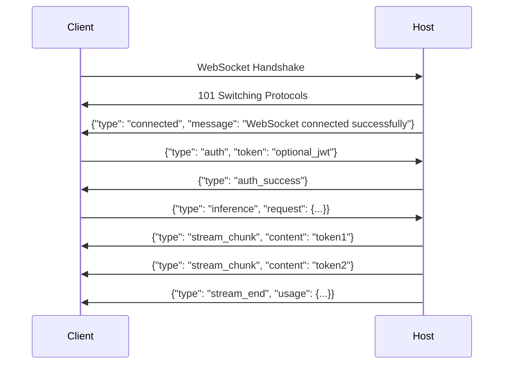

# WebSocket Protocol Guide

## Overview

This guide documents the WebSocket protocol used for real-time communication between the Fabstir SDK and LLM host nodes. The protocol enables streaming token generation, session management, and bidirectional communication at the `/v1/ws` endpoint.

## Connection Establishment

### Endpoint

```
ws://[host]:[port]/v1/ws
wss://[host]/v1/ws  (for secure connections)
```

### Connection Flow



## Message Protocol

All messages are JSON-encoded and follow a type-based structure.

### Base Message Structure

```typescript
interface WebSocketMessage {
  type: string;           // Message type identifier
  timestamp?: number;     // Unix timestamp (optional)
  messageId?: string;     // Unique message ID (optional)
  [key: string]: any;     // Type-specific fields
}
```

## Client -> Host Messages

### 1. Authentication (Optional)

```json
{
  "type": "auth",
  "token": "jwt_token_here",
  "sessionId": "optional_session_id"
}
```

### 2. Inference Request

```json
{
  "type": "inference",
  "request": {
    "prompt": "Explain quantum computing",
    "model": "llama-2-7b",
    "max_tokens": 500,
    "temperature": 0.7,
    "top_p": 0.9,
    "stream": true,
    "stop_sequences": ["\\n\\n", "###"]
  },
  "sessionId": "optional_session_id",
  "messageId": "unique_request_id"
}
```

### 3. Session Initialization

```json
{
  "type": "session_init",
  "sessionId": "uuid_v4",
  "jobId": 12345,
  "model": "llama-2-13b-chat",
  "conversationContext": [
    {"role": "system", "content": "You are a helpful assistant"},
    {"role": "user", "content": "Previous question"},
    {"role": "assistant", "content": "Previous response"}
  ]
}
```

### 4. Session Resume

```json
{
  "type": "session_resume",
  "sessionId": "existing_session_id",
  "lastCheckpoint": 5,
  "conversationContext": []
}
```

### 5. Ping/Keep-Alive

```json
{
  "type": "ping",
  "timestamp": 1699123456789
}
```

### 6. Cancel Request

```json
{
  "type": "cancel",
  "requestId": "request_to_cancel"
}
```

### 7. Image Generation Request (Encrypted)

Send an image generation request via the encrypted WebSocket channel (node v8.16.0+). The request is sent as an `encrypted_message` with `action: "image_generation"` in the encrypted payload.

```json
{
  "type": "encrypted_message",
  "session_id": "session_123",
  "id": "img-1739612345678-abc",
  "payload": {
    "ciphertextHex": "...",
    "nonceHex": "...",
    "aadHex": ""
  }
}
```

**Encrypted payload (plaintext before encryption):**

```json
{
  "action": "image_generation",
  "prompt": "A cat astronaut floating in space",
  "size": "512x512",
  "steps": 4,
  "model": "flux-1-schnell",
  "safetyLevel": "strict",
  "chainId": 84532
}
```

**Fields:**
- `action` (string, required): Must be `"image_generation"` — routes to diffusion sidecar instead of LLM
- `prompt` (string, required): Text description (1-2000 characters)
- `size` (string): Image dimensions. Allowed: `256x256`, `512x512`, `768x768`, `1024x1024`, `1024x768`, `768x1024`. Default: `1024x1024`
- `steps` (number): Diffusion steps (1-100). Default: `4`
- `model` (string, optional): Model override
- `seed` (number, optional): Seed for reproducibility
- `negativePrompt` (string, optional): Negative prompt
- `safetyLevel` (string): `"strict"` | `"moderate"` | `"permissive"`. Default: `"strict"`

## Host -> Client Messages

### 1. Connection Confirmation

```json
{
  "type": "connected",
  "message": "WebSocket connected successfully",
  "version": "1.0.0",
  "capabilities": ["streaming", "checkpoints", "compression"],
  "models": ["llama-2-7b", "tiny-vicuna-1b"]
}
```

### 2. Authentication Success

```json
{
  "type": "auth_success",
  "sessionId": "assigned_session_id",
  "expiresAt": 1699127056789
}
```

### 3. Stream Chunk

```json
{
  "type": "stream_chunk",
  "content": "The next token",
  "index": 42,
  "finish_reason": null
}
```

### 4. Stream End

```json
{
  "type": "stream_end",
  "finish_reason": "stop",
  "usage": {
    "prompt_tokens": 25,
    "completion_tokens": 150,
    "total_tokens": 175,
    "context_window_size": 32768
  },
  "duration_ms": 2340
}
```

**Fields (v8.21.0+):**
- `finish_reason` — `"stop"` (natural end), `"length"` (max_tokens hit), `"cancelled"` (user aborted)
- `usage.prompt_tokens` — Number of tokens in the prompt
- `usage.completion_tokens` — Number of tokens generated
- `usage.total_tokens` — Sum of prompt + completion tokens
- `usage.context_window_size` — Model's maximum context window size
- `duration_ms` — Inference duration in milliseconds

The SDK computes `contextUtilization = (prompt_tokens + completion_tokens) / context_window_size` and fires the `onContextWarning` callback when this exceeds the configured threshold (default 0.8).

### 5. Error Message

```json
{
  "type": "error",
  "error": {
    "code": "MODEL_NOT_AVAILABLE",
    "message": "The requested model is not available",
    "details": {
      "requested_model": "gpt-4",
      "available_models": ["llama-2-7b", "tiny-vicuna-1b"]
    }
  },
  "requestId": "failed_request_id"
}
```

**Context limit error (v8.21.0+):**
```json
{
  "type": "error",
  "code": "TOKEN_LIMIT_EXCEEDED",
  "message": "Prompt exceeds context window",
  "prompt_tokens": 33500,
  "context_window_size": 32768
}
```

### 6. Checkpoint Proof

```json
{
  "type": "checkpoint",
  "checkpoint": {
    "number": 3,
    "tokenCount": 1000,
    "conversationHash": "0xabc123...",
    "timestamp": 1699123456789,
    "signature": "0xdef456..."
  }
}
```

### 7. Pong Response

```json
{
  "type": "pong",
  "timestamp": 1699123456790,
  "latency": 1
}
```

### 8. Image Generation Result (Encrypted)

Returned when the host successfully generates an image (node v8.16.0+). The response arrives as an `encrypted_response` containing the result in the encrypted payload.

```json
{
  "type": "encrypted_response",
  "session_id": "session_123",
  "payload": {
    "ciphertextHex": "...",
    "nonceHex": "...",
    "aadHex": "encrypted_image_response"
  }
}
```

**Decrypted payload:**

```json
{
  "type": "image_generation_result",
  "image": "<base64-encoded PNG>",
  "model": "stable-diffusion-xl",
  "size": "512x512",
  "steps": 4,
  "seed": 99999,
  "processingTimeMs": 3200,
  "safety": {
    "promptSafe": true,
    "outputSafe": true,
    "safetyLevel": "strict"
  },
  "billing": {
    "generationUnits": 0.05,
    "modelMultiplier": 1.0,
    "megapixels": 0.26,
    "steps": 4
  },
  "provider": "0x1234...",
  "chainId": 84532,
  "chainName": "Base Sepolia",
  "nativeToken": "ETH"
}
```

### 9. Image Generation Error (Encrypted)

Returned when image generation fails:

```json
{
  "type": "encrypted_response",
  "session_id": "session_123",
  "payload": {
    "ciphertextHex": "...",
    "nonceHex": "...",
    "aadHex": ""
  }
}
```

**Decrypted payload:**

```json
{
  "type": "image_generation_error",
  "error_code": "PROMPT_BLOCKED",
  "error": "Prompt blocked by safety classifier"
}
```

**Error codes:**
- `PROMPT_BLOCKED` — Safety classifier rejected the prompt
- `DIFFUSION_SERVICE_UNAVAILABLE` — Diffusion sidecar not running
- `IMAGE_GENERATION_FAILED` — Generation failed (retryable)

## Advanced Features

### Compression

The WebSocket connection supports per-message compression using the `permessage-deflate` extension.

```javascript
const ws = new WebSocket('ws://localhost:8080/v1/ws', {
  perMessageDeflate: {
    zlibDeflateOptions: {
      level: 9,
      memLevel: 8,
      strategy: 0
    },
    zlibInflateOptions: {
      chunkSize: 10 * 1024
    },
    threshold: 1024 // Only compress messages > 1KB
  }
});
```

### Binary Frame Support

For efficient token streaming, binary frames can be used:

```javascript
// Binary frame structure (for high-performance streaming)
// [1 byte: type] [4 bytes: token_id] [variable: token_text]

ws.on('message', (data, isBinary) => {
  if (isBinary) {
    const type = data[0];
    if (type === 0x01) { // Stream token
      const tokenId = data.readUInt32BE(1);
      const token = data.slice(5).toString('utf-8');
      handleToken(token);
    }
  }
});
```

### Multiplexing Sessions

Multiple sessions can be multiplexed over a single WebSocket connection:

```json
{
  "type": "inference",
  "sessionId": "session_1",
  "request": {...}
}

{
  "type": "inference", 
  "sessionId": "session_2",
  "request": {...}
}
```

## Connection Management

### Reconnection Strategy

```javascript
class WebSocketManager {
  private reconnectAttempts = 0;
  private maxReconnectAttempts = 5;
  private reconnectDelay = 1000;
  
  async connect(url: string) {
    try {
      this.ws = new WebSocket(url);
      this.setupEventHandlers();
    } catch (error) {
      await this.handleReconnect();
    }
  }
  
  private async handleReconnect() {
    if (this.reconnectAttempts >= this.maxReconnectAttempts) {
      throw new Error('Max reconnection attempts exceeded');
    }
    
    this.reconnectAttempts++;
    const delay = this.reconnectDelay * Math.pow(2, this.reconnectAttempts - 1);
    
    await new Promise(resolve => setTimeout(resolve, delay));
    await this.connect(this.url);
  }
  
  private setupEventHandlers() {
    this.ws.on('close', (code, reason) => {
      if (code !== 1000) { // Abnormal closure
        this.handleReconnect();
      }
    });
    
    this.ws.on('error', (error) => {
      console.error('WebSocket error:', error);
      this.handleReconnect();
    });
  }
}
```

### Health Monitoring

```javascript
class HealthMonitor {
  private pingInterval: NodeJS.Timer;
  private lastPong: number;
  private timeout = 30000; // 30 seconds
  
  startMonitoring(ws: WebSocket) {
    this.pingInterval = setInterval(() => {
      if (Date.now() - this.lastPong > this.timeout) {
        console.error('Connection timeout - no pong received');
        ws.close();
        return;
      }
      
      ws.send(JSON.stringify({
        type: 'ping',
        timestamp: Date.now()
      }));
    }, 10000); // Ping every 10 seconds
    
    ws.on('message', (data) => {
      const msg = JSON.parse(data);
      if (msg.type === 'pong') {
        this.lastPong = Date.now();
      }
    });
  }
  
  stopMonitoring() {
    clearInterval(this.pingInterval);
  }
}
```

## Implementation Examples

### Basic Client Implementation

```typescript
class FabstirWebSocketClient {
  private ws: WebSocket;
  private messageQueue: Map<string, Function> = new Map();
  
  async connect(hostUrl: string): Promise<void> {
    return new Promise((resolve, reject) => {
      this.ws = new WebSocket(`${hostUrl}/v1/ws`);
      
      this.ws.on('open', () => {
        console.log('WebSocket connected');
      });
      
      this.ws.on('message', (data) => {
        const message = JSON.parse(data.toString());
        
        if (message.type === 'connected') {
          resolve();
        } else {
          this.handleMessage(message);
        }
      });
      
      this.ws.on('error', reject);
    });
  }
  
  async *streamInference(prompt: string, options = {}): AsyncGenerator<string> {
    const requestId = crypto.randomUUID();
    
    // Send inference request
    this.ws.send(JSON.stringify({
      type: 'inference',
      messageId: requestId,
      request: {
        prompt,
        stream: true,
        ...options
      }
    }));
    
    // Stream tokens
    const tokenBuffer: string[] = [];
    let ended = false;
    
    const tokenPromise = new Promise<void>((resolve) => {
      this.messageQueue.set(requestId, (message) => {
        if (message.type === 'stream_chunk') {
          tokenBuffer.push(message.content);
        } else if (message.type === 'stream_end') {
          ended = true;
          resolve();
        }
      });
    });
    
    // Yield tokens as they arrive
    while (!ended) {
      if (tokenBuffer.length > 0) {
        yield tokenBuffer.shift()!;
      } else {
        await new Promise(r => setTimeout(r, 10));
      }
    }
    
    await tokenPromise;
    
    // Yield any remaining tokens
    while (tokenBuffer.length > 0) {
      yield tokenBuffer.shift()!;
    }
  }
  
  private handleMessage(message: any) {
    if (message.messageId && this.messageQueue.has(message.messageId)) {
      this.messageQueue.get(message.messageId)!(message);
    }
  }
  
  close() {
    this.ws.close();
  }
}
```

### React Hook for WebSocket Streaming

```typescript
import { useState, useEffect, useCallback } from 'react';

function useWebSocketInference(hostUrl: string) {
  const [client, setClient] = useState<FabstirWebSocketClient | null>(null);
  const [connected, setConnected] = useState(false);
  const [streaming, setStreaming] = useState(false);
  
  useEffect(() => {
    const wsClient = new FabstirWebSocketClient();
    
    wsClient.connect(hostUrl)
      .then(() => {
        setClient(wsClient);
        setConnected(true);
      })
      .catch(console.error);
    
    return () => {
      wsClient.close();
    };
  }, [hostUrl]);
  
  const streamInference = useCallback(async function* (
    prompt: string,
    options = {}
  ) {
    if (!client || !connected) {
      throw new Error('WebSocket not connected');
    }
    
    setStreaming(true);
    
    try {
      for await (const token of client.streamInference(prompt, options)) {
        yield token;
      }
    } finally {
      setStreaming(false);
    }
  }, [client, connected]);
  
  return {
    connected,
    streaming,
    streamInference
  };
}

// Usage in component
function ChatComponent() {
  const { connected, streaming, streamInference } = useWebSocketInference(
    'ws://localhost:8080'
  );
  const [response, setResponse] = useState('');
  
  const handleSubmit = async (prompt: string) => {
    setResponse('');
    
    for await (const token of streamInference(prompt)) {
      setResponse(prev => prev + token);
    }
  };
  
  return (
    <div>
      {connected ? 'Connected' : 'Connecting...'}
      {streaming && 'Generating...'}
      <div>{response}</div>
    </div>
  );
}
```

## Error Handling

### Error Codes

| Code | Description | Recovery Action |
|------|-------------|-----------------|
| `AUTH_FAILED` | Authentication failed | Refresh token and retry |
| `MODEL_NOT_AVAILABLE` | Requested model not found | Use different model |
| `RATE_LIMIT_EXCEEDED` | Too many requests | Implement backoff |
| `SESSION_EXPIRED` | Session timed out | Create new session |
| `INVALID_REQUEST` | Malformed request | Check request format |
| `SERVER_ERROR` | Internal server error | Retry with backoff |
| `QUOTA_EXCEEDED` | Token quota exceeded | Wait or upgrade plan |
| `TOKEN_LIMIT_EXCEEDED` | Prompt exceeds context window | Trim history and retry (see `ContextLimitError`) |

### Error Recovery Example

```typescript
async function robustInference(client: FabstirWebSocketClient, prompt: string) {
  const maxRetries = 3;
  let lastError;
  
  for (let attempt = 1; attempt <= maxRetries; attempt++) {
    try {
      const tokens = [];
      for await (const token of client.streamInference(prompt)) {
        tokens.push(token);
      }
      return tokens.join('');
      
    } catch (error: any) {
      lastError = error;
      
      if (error.code === 'RATE_LIMIT_EXCEEDED') {
        // Exponential backoff
        await new Promise(r => setTimeout(r, 1000 * Math.pow(2, attempt)));
        
      } else if (error.code === 'SESSION_EXPIRED') {
        // Reconnect
        await client.connect(client.url);
        
      } else if (error.code === 'MODEL_NOT_AVAILABLE') {
        // Can't recover from this
        throw error;
      }
    }
  }
  
  throw lastError;
}
```

## Performance Considerations

### Message Batching

```typescript
class BatchedWebSocketClient {
  private messageBuffer: any[] = [];
  private batchInterval: NodeJS.Timer;
  
  constructor(private ws: WebSocket) {
    this.batchInterval = setInterval(() => this.flushBatch(), 50);
  }
  
  send(message: any) {
    this.messageBuffer.push(message);
    
    if (this.messageBuffer.length >= 10) {
      this.flushBatch();
    }
  }
  
  private flushBatch() {
    if (this.messageBuffer.length === 0) return;
    
    if (this.messageBuffer.length === 1) {
      this.ws.send(JSON.stringify(this.messageBuffer[0]));
    } else {
      this.ws.send(JSON.stringify({
        type: 'batch',
        messages: this.messageBuffer
      }));
    }
    
    this.messageBuffer = [];
  }
}
```

### Token Buffering

```typescript
class TokenBuffer {
  private buffer: string[] = [];
  private bufferSize: number;
  
  constructor(size = 10) {
    this.bufferSize = size;
  }
  
  add(token: string): string | null {
    this.buffer.push(token);
    
    if (this.buffer.length >= this.bufferSize) {
      const result = this.buffer.join('');
      this.buffer = [];
      return result;
    }
    
    return null;
  }
  
  flush(): string {
    const result = this.buffer.join('');
    this.buffer = [];
    return result;
  }
}
```

## Security Best Practices

1. **Always use WSS in production** for encrypted connections
2. **Implement authentication** using JWT tokens or API keys
3. **Validate all inputs** on both client and server
4. **Rate limit connections** per IP/user
5. **Set maximum message sizes** to prevent memory exhaustion
6. **Implement connection timeouts** for idle connections
7. **Use origin validation** to prevent CSRF attacks
8. **Monitor for abnormal patterns** (e.g., rapid reconnections)

## Testing

### Mock WebSocket Server

```typescript
import { WebSocketServer } from 'ws';

class MockLLMServer {
  private wss: WebSocketServer;
  
  constructor(port = 8080) {
    this.wss = new WebSocketServer({ port, path: '/v1/ws' });
    
    this.wss.on('connection', (ws) => {
      // Send welcome message
      ws.send(JSON.stringify({
        type: 'connected',
        message: 'Mock server connected'
      }));
      
      ws.on('message', (data) => {
        const message = JSON.parse(data.toString());
        
        if (message.type === 'inference') {
          this.handleInference(ws, message);
        }
      });
    });
  }
  
  private async handleInference(ws: WebSocket, message: any) {
    const tokens = 'This is a mock response'.split(' ');
    
    for (const token of tokens) {
      ws.send(JSON.stringify({
        type: 'stream_chunk',
        content: token + ' '
      }));
      
      await new Promise(r => setTimeout(r, 100));
    }
    
    ws.send(JSON.stringify({
      type: 'stream_end',
      usage: {
        prompt_tokens: 10,
        completion_tokens: tokens.length,
        total_tokens: 10 + tokens.length
      }
    }));
  }
}
```

## Related Documentation

- [SDK API Reference](./SDK_API.md)
- [Encryption Guide](./ENCRYPTION_GUIDE.md)
- [WebSocket API & SDK Integration Guide](./node-reference/WEBSOCKET_API_SDK_GUIDE.md)
- [Node API Reference](./node-reference/API.md)