# Phase 1: Dependency Analysis Report

## Executive Summary

This document provides a comprehensive analysis of Node.js dependencies in FabstirSDK and classifies each component by its target environment (browser-compatible vs server-only).

**Key Finding**: FabstirSDK is currently **not browser-compatible** due to extensive Node.js dependencies across multiple managers.

## 1. Node.js Dependencies Identified

### 1.1 Core SDK Dependencies

#### FabstirSDK.ts
- **process.env**: Used extensively for environment variables (lines 35-50)
  - `process.env.CONTRACT_JOB_MARKETPLACE`
  - `process.env.CONTRACT_NODE_REGISTRY`
  - `process.env.CONTRACT_FAB_TOKEN`
  - `process.env.CONTRACT_USDC_TOKEN`
  - **Browser Alternative**: Pass config object or use build-time replacement

### 1.2 Manager-Specific Dependencies

#### InferenceManager.ts
- **crypto module** (line 3): `import { createHash, randomBytes } from 'crypto';`
  - Used for: JWT creation, signature generation, hash computation
  - **Browser Alternative**: Web Crypto API
- **Buffer**: Extensive usage for encoding/decoding
  - Lines 313, 430, 711-712, 848-849, 1000, 1451-1452, 1536-1537
  - **Browser Alternative**: TextEncoder/TextDecoder or Buffer polyfill
- **zlib**: Compression (lines 313, 1001)
  - `zlib.gzipSync`, `zlib.gunzipSync`
  - **Browser Alternative**: CompressionStreams API or pako library
- **process.env**: Multiple usage for configuration

#### DiscoveryManager.ts
- **libp2p** (lines 59-62): Dynamic imports
  - `import('libp2p')`
  - `import('@libp2p/tcp')`
  - `import('@chainsafe/libp2p-noise')`
  - `import('@chainsafe/libp2p-yamux')`
  - **Classification**: SERVER-ONLY - Cannot run in browser
- **Buffer.concat** (line 149): For data concatenation
  - **Browser Alternative**: Uint8Array operations

#### P2P Client (src/p2p/client.ts)
- **libp2p ecosystem** (lines 15-23):
  - Full libp2p stack including TCP, WebSockets, DHT, mDNS
  - **Classification**: SERVER-ONLY - Core P2P functionality

#### AuthManager.ts
- No direct Node.js imports found
- **Classification**: BROWSER-COMPATIBLE with minor adjustments

#### PaymentManager.ts
- **process.env**: Environment variable access
- No other Node.js specific imports
- **Classification**: BROWSER-COMPATIBLE with config refactor

#### StorageManager.ts
- Uses S5.js which is browser-compatible
- **Classification**: BROWSER-COMPATIBLE

#### SessionManager.ts
- **process.env**: Configuration access
- Uses ethers.utils.randomBytes (browser-compatible)
- **Classification**: BROWSER-COMPATIBLE with config refactor

#### HostManager.ts
- **process.env**: Environment variables
- **Classification**: BROWSER-COMPATIBLE with config refactor

#### SmartWalletManager.ts
- **process.env**: Configuration
- **Classification**: BROWSER-COMPATIBLE with config refactor

#### TreasuryManager.ts
- **process.env**: Configuration
- **Classification**: BROWSER-COMPATIBLE with config refactor

#### BaseAccountIntegration.ts
- **process.env**: Configuration
- **Classification**: BROWSER-COMPATIBLE with config refactor

## 2. Component Classification by Environment

### 2.1 Browser-Compatible Components (sdk-core)

| Component | Current Issues | Required Changes |
|-----------|---------------|------------------|
| **AuthManager** | None | Ready for browser |
| **PaymentManager** | process.env | Replace with config object |
| **StorageManager** | None | Already uses S5.js (browser-compatible) |
| **SessionManager** | process.env | Replace with config object |
| **HostManager** | process.env | Replace with config object |
| **SmartWalletManager** | process.env | Replace with config object |
| **TreasuryManager** | process.env | Replace with config object |
| **BaseAccountIntegration** | process.env | Replace with config object |
| **Contract ABIs** | None | Pure JSON - browser ready |
| **Types** | None | Pure TypeScript interfaces |

### 2.2 Server-Only Components (sdk-node)

| Component | Node.js Dependencies | Reason for Server-Only |
|-----------|---------------------|------------------------|
| **DiscoveryManager** | libp2p, TCP, Buffer | P2P networking requires Node.js |
| **P2PClient** | Full libp2p stack | Core P2P functionality |
| **EZKL Proof Generation** | Heavy crypto operations | Computational requirements |
| **WebSocket Server** | ws package | Server-side WebSocket handling |

### 2.3 Mixed Components (Need Splitting)

| Component | Browser Parts | Server Parts |
|-----------|--------------|-------------|
| **InferenceManager** | Contract interactions, session management | crypto module usage, zlib compression |
| **WebSocketClient** | WebSocket connections | May need different implementations |
| **FabstirSDK** | Core SDK logic, manager orchestration | process.env usage |

## 3. Dependency Migration Strategy

### 3.1 Immediate Replacements Needed

1. **process.env → Config Object**
   ```typescript
   // Current (Node.js)
   const address = process.env.CONTRACT_JOB_MARKETPLACE;
   
   // Browser-compatible
   const address = config.contractAddresses.jobMarketplace;
   ```

2. **crypto module → Web Crypto API**
   ```typescript
   // Current (Node.js)
   import { createHash, randomBytes } from 'crypto';
   
   // Browser-compatible
   const crypto = window.crypto || globalThis.crypto;
   ```

3. **Buffer → TextEncoder/Decoder**
   ```typescript
   // Current (Node.js)
   Buffer.from(data).toString('base64');
   
   // Browser-compatible
   btoa(String.fromCharCode(...new TextEncoder().encode(data)));
   ```

4. **zlib → CompressionStreams or pako**
   ```typescript
   // Current (Node.js)
   zlib.gzipSync(data);
   
   // Browser-compatible
   await new Response(
     new Blob([data]).stream()
       .pipeThrough(new CompressionStream('gzip'))
   ).arrayBuffer();
   ```

### 3.2 Components Requiring Architectural Changes

1. **P2P Networking**: Must remain server-side
   - Create WebSocket bridge for browser clients
   - Implement RPC protocol for P2P operations

2. **InferenceManager**: Needs splitting
   - Browser: Contract interactions, session management
   - Server: Proof generation, heavy crypto

## 4. Architecture Diagram

```mermaid
graph TB
    subgraph "Browser Environment"
        SDK_CORE["@fabstir/sdk-core"]
        AUTH["AuthManager ✅"]
        PAYMENT["PaymentManager ✅"]
        STORAGE["StorageManager ✅"]
        SESSION["SessionManager ✅"]
        HOST["HostManager ✅"]
        SMART["SmartWalletManager ✅"]
        TREASURY["TreasuryManager ✅"]
        CONTRACTS["Contract ABIs ✅"]
        
        SDK_CORE --> AUTH
        SDK_CORE --> PAYMENT
        SDK_CORE --> STORAGE
        SDK_CORE --> SESSION
        SDK_CORE --> HOST
        SDK_CORE --> SMART
        SDK_CORE --> TREASURY
        SDK_CORE --> CONTRACTS
    end
    
    subgraph "Server Environment"
        SDK_NODE["@fabstir/sdk-node"]
        DISCOVERY["DiscoveryManager ❌"]
        P2P["P2PClient ❌"]
        EZKL["EZKL Proofs ❌"]
        WS_SERVER["WebSocket Server ❌"]
        
        SDK_NODE --> DISCOVERY
        SDK_NODE --> P2P
        SDK_NODE --> EZKL
        SDK_NODE --> WS_SERVER
    end
    
    subgraph "Shared/Bridge"
        INFERENCE["InferenceManager ⚠️"]
        WS_CLIENT["WebSocketClient ⚠️"]
    end
    
    SDK_CORE -.->|"WebSocket Bridge"| SDK_NODE
    SDK_CORE --> INFERENCE
    SDK_NODE --> INFERENCE
    
    style SDK_CORE fill:#90EE90
    style SDK_NODE fill:#FFB6C1
    style INFERENCE fill:#FFFFE0
```



**Legend**:
- ✅ Browser-compatible (minor changes needed)
- ❌ Server-only (cannot run in browser)
- ⚠️ Needs splitting/refactoring

## 5. Risk Assessment

### High Risk Areas
1. **InferenceManager crypto operations**: Complex refactoring needed
2. **P2P Discovery**: Fundamental architecture change required
3. **WebSocket implementation differences**: May need dual implementations

### Low Risk Areas
1. **Contract interactions**: Already mostly browser-compatible
2. **S5 Storage**: Designed for browser use
3. **Wallet management**: Uses ethers.js (browser-compatible)

## 6. Implementation Priority

1. **Phase 1** ✅: Dependency Analysis (THIS DOCUMENT)
2. **Phase 2**: Create package structure
3. **Phase 3**: Refactor config system (remove process.env)
4. **Phase 4**: Replace crypto with Web Crypto API
5. **Phase 5**: Split InferenceManager
6. **Phase 6**: Move P2P to server package
7. **Phase 7**: Create WebSocket bridge
8. **Phase 8**: Testing & validation

## 7. Next Steps

1. ✅ Complete dependency analysis
2. ⏳ Create package structure (`packages/sdk-core` and `packages/sdk-node`)
3. ⏳ Begin systematic refactoring starting with config system

---

**Analysis Complete**: Ready to proceed with Phase 2 - Package Structure Setup